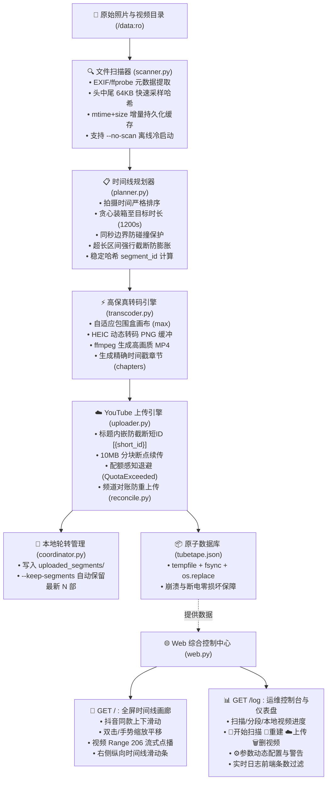

# TubeTape

> **家庭照片与视频的高清时间胶囊**：自动将海量家庭照片、手机实拍与相机视频，按时间线智能聚合成高保真分段长视频，安全冷备至 YouTube 私人频道；内置抖音同款全屏时间线画廊与全功能实时运维仪表盘。

[](LICENSE)
[](pyproject.toml)
[](https://hub.docker.com/r/chet2026/tubetape)
[](pyproject.toml)

---

## 目录

- [为什么选择 TubeTape？](#为什么选择-tubetape)
- [核心特性概览](#核心特性概览)
- [系统架构与工作流程](#系统架构与工作流程)
- [快速开始](#快速开始)
  - [方式一：Docker Compose（推荐，长期挂机首选）](#方式一docker-compose推荐长期挂机首选)
  - [方式二：Docker CLI 直接运行](#方式二docker-cli-直接运行)
  - [方式三：原生 Python 环境运行](#方式三原生-python-环境运行)
- [Web 交互系统深度指南](#web-交互系统深度指南)
  - [📱 全屏时间线画廊（根路径 `/`）](#-全屏时间线画廊根路径-)
  - [🎯 精确时间戳媒体直达（`/getbytime/...`）](#-精确时间戳媒体直达getbytime)
  - [📊 运行控制台与仪表盘（`/log`）](#-运行控制台与仪表盘log)
  - [🔑 Google YouTube OAuth 授权指南](#-google-youtube-oauth-授权指南)
- [参数完全手册（CLI Options Reference）](#参数完全手册cli-options-reference)
  - [1. 基础与存储参数](#1-基础与存储参数)
  - [2. 扫描与运行模式控制](#2-扫描与运行模式控制)
  - [3. 媒体过滤与文件筛选](#3-媒体过滤与文件筛选)
  - [4. 时间线与分段规划参数（⚠️ 影响指纹）](#4-时间线与分段规划参数-影响指纹)
  - [5. 画质与视频编码参数（⚠️ 影响指纹）](#5-画质与视频编码参数-影响指纹)
  - [6. YouTube 与云端参数](#6-youtube-与云端参数)
  - [7. 持续监控（Watch）与去抖参数](#7-持续监控watch与去抖参数)
  - [8. 日志与调试参数](#8-日志与调试参数)
  - [⚠️ 核心概念：segment_id 指纹机制与变更影响](#-核心概念segment_id-指纹机制与变更影响)
  - [常用场景推荐参数组合](#常用场景推荐参数组合)
- [本地数据存储结构与持久化](#本地数据存储结构与持久化)
- [常见问题 FAQ](#常见问题-faq)
- [许可证](#许可证)

---

## 为什么选择 TubeTape？

家庭 NAS、外置移动硬盘或电脑中往往积累了数十万张散乱的照片和零星的短视频：
- **冷备与异地容灾成本高**：家庭素材动辄数 TB，本地多盘 RAID 或异地备份硬件成本高昂，商业网盘存在容量封顶、持续年费且有隐私泄漏或封禁风险。
- **回顾体验差、回忆沦为“数字遗物”**：数万张碎片化文件散落在深层文件夹中，翻看极为繁琐，极少有人愿意逐张浏览，珍贵的家庭回忆逐渐被遗忘。
- **云端压缩严重损坏画质**：大多数社交相册或网盘在转码预览时都会对原画进行极度激进的降采样和有损压缩。

**TubeTape 的解决方案**：
1. **智能聚合为高清时间胶囊**：按照照片与视频的拍摄时间线，严格按时间先后智能打包串联为固定时长的长视频（如 20 分钟或 1 小时/部），照片化为动态胶片，并附带精确到秒的章节时间戳。
2. **免费无限容量云端冷备**：YouTube 支持免费无限量存储私人高清视频（最高支持 8K 60FPS），提供全球顶尖的灾备能力与流媒体回放体验。
3. **免客户端随时随地全家共享**：无论在客厅电视、手机、平板还是投影仪，任何支持 YouTube 的设备均可一键点播家庭记录，无需额外安装专用客户端。
4. **内置抖音同款全屏画廊**：即使不依赖 YouTube，TubeTape 本地也提供极速流畅的沉浸式全屏垂直滑动画廊，支持 iPhone HEIC 原图高速渲染与视频 HTTP 206 流式点播。

---

## 核心特性概览

- **📱 抖音同款时间线全屏画廊（`/`）**：
  - **分段优先导航（Segment-First）**：顶部状态栏内置分段下拉选择器与 `◀ 上一分片` / `下一分片 ▶` 切换键，直连对应 YouTube 视频链接；滑动到分片首尾可平滑跨分段穿梭。
  - **沉浸式交互**：纯黑背景全屏展示，支持触屏手势、鼠标滚轮、键盘上下键（`↑`/`↓`）流畅纵向滑动切换。
  - **真实物理路径标注**：底部浮动信息卡片清晰展示每张照片或视频在宿主机/NAS 上的真实绝对路径，点击即可一键复制。
  - **图片高清缩放**：双击 2.5 倍缩放、移动端触屏双指捏合缩放、放大后支持自由平移拖拽查看细节。
  - **视频智能静音播放**：切入即静音自动播放（突破现代浏览器自动播放限制），右上角提供全局一键声音开关。
  - **右侧纵向时间线滑动条（Scrubber）**：悬浮或拖拽滑块即时显示年月日期浮动气泡，秒级跨越年月定位素材。
  - **全格式高效串流**：iPhone HEIC/HEIF 图片服务端自动转码 JPEG 并支持多级缓存；视频支持标准 HTTP 206 Partial Content (Range) 分块流式快速播放。
- **🎯 精确时间戳媒体直达（`/getbytime/...`）**：
  - 访问 `http://<IP>:<PORT>/getbytime/{segment_id}/{min}/{sec}` 即可秒级定位并呈现该时刻对应的真实文件。
  - 专为 YouTube 观影设计：从 YouTube 视频标题中复制 16 位短 ID `[{short_id}]`（或 64 位完整哈希），配合播放器进度即可直达原始素材。
  - 页面直观呈现媒体预览、拍摄时间、时长、分辨率，并醒目标注宿主机真实物理绝对路径（带一键复制）。
  - 支持 `?raw=1` 重定向直接播放流媒体/原图，支持 `?format=json` 返回结构化机器元数据。
- **📊 全功能实时运维仪表盘（`/log`）**：
  - **实时状态看板**：已扫描媒体总数与实时扫描进度、时间线全量分段 Timeline（等待构建、正在构建动态百分比进度条与当前处理文件名、已构建完成、已上传完成及直达链接）。
  - **本地文件状态与磁盘保留统计**：直观展示本地是否存在 MP4 文件，实时显示本地保留数量。
  - **一键运维动作**：
    - **🔄 开始全量扫描**：随时按需一键触发重新扫描，发现新增文件。
    - **🔨 重新构建**：对任意分段发起就地重新转码。
    - **☁️ 重新上传**：本地已有视频文件时一键直传 YouTube。
    - **🗑️ 删除云端视频**：一键调用 YouTube API 删除云端对应视频并重置数据库状态。
    - **⚙️ 运行时参数动态配置**：弹窗直接修改运行参数，实时警示指纹参数变动风险，修改后自动落盘到 `config.json`。
  - **前端实时日志过滤**：支持日志色彩高亮（INFO 蓝、WARN 黄、ERROR 红、DEBUG 灰），下拉菜单自由配置显示最近条数（**默认 100 条**，可选 50、100、200、500、全部），支持自动滚动与一键清屏。
- **💾 本地分片智能保留与轮转（`--keep-segments`）**：
  - 转码完成的 MP4 文件统一存放在配置目录的 `uploaded_segments/` 文件夹下（**非隐藏文件**，便于在宿主机或 NAS 文件管理器中直接拷贝提取）。
  - 支持保留最新 $N$ 部视频（默认 $0$ 即传即删节省磁盘；设置为 $N$ 时按文件修改时间自动轮转淘汰旧分段）。
  - 支持 `--no-upload` 纯本地构建模式：只构建本地视频而不上传云端，本地视频同样遵循 `--keep-segments` 轮转。
- **📋 不可变增量追加规划（Immutable Append-Only Planner）**：
  - 历史已封板分片永久不可变，增量扫描素材绝不打散、拆分或重构已有分片，彻底守护 YouTube 每日配额与永久视频链接。
  - 严格按拍摄时间排序，未标记时间戳的文件以 `file_id` 字典序稳定排在最前端；若分片素材均无时间戳，紧凑命名为 `19700101_000000-19700101_000000_[{short_id}]`。
  - 仅处于时间线最前沿的新增素材进入待封板 Pending 分片；历史回填文件或无时间戳文件独立封装为新分片立即处理。
- **📝 极简精纯 YouTube 简介**：
  - 视频简介仅保留照片总数、视频总数、总时长与各子视频纯时长清单（`1. M:SS`），清爽无冗余文件名。
- **⚡ 极速冷启动（`--no-scan` / `--skip-scan`）**：
  - 针对数万至数十万张照片的海量媒体库，启动时可跳过全量磁盘扫描，直接从持久化数据库 `tubetape.json` 毫秒级恢复状态并开启文件变更监听。需要时随时在 Dashboard 点击“开始全量扫描”。
- **🔑 零 `.env` 极简部署与 Web 交互式授权**：
  - 彻底移除环境变量文件，媒体目录在 `docker-compose.yml` 中声明只读挂载即可。
  - 首次启动若未检测到 OAuth Token，自动进入待授权等待状态，访问 Web 页面即可一键点击链接完成 Google OAuth 授权，凭据自动写盘并无缝继续运行，无需重启容器。
- **🎞️ 电影级高画质自适应转码引擎**：
  - 默认自适应最大包围盒画布（`--canvas-mode max`），绝不主动降采样；支持高达 8K（7680x4320）60FPS。
  - 默认采用高保真电影级压制参数（`--crf 16`，`--x264-preset slow`，`--fps 60`）。
  - 智能解析各类媒体：iPhone Live Photos、HEIC/HEIF、MOV、MP4、MKV、3GP 等，可选 Ken Burns 动态推拉镜头。
- **🔒 防截断短 ID 云端容灾对账**：
  - 视频标题内嵌唯一短哈希 `[{short_id}]`，彻底根除因 YouTube API 截断简介 Marker 导致的云端对账丢失与无限重复上传。
  - 本地数据库即便意外损毁或丢失，TubeTape 也能自动从 YouTube 频道拉取已有列表秒级恢复，零重复上传。
- **🚀 10MB 分块断点续传与配额自愈**：
  - 采用 10MB 分块流式上传（`request.next_chunk()`），遇网络瞬断指数退避重试，绝不重新建片。
  - 遇到 YouTube 每日上传配额耗尽（`quotaExceeded`）自动休眠退避（默认 1 小时），配额刷新后平稳继续。
- **🛡️ 只读源文件与 Docker 平稳停机**：
  - 源照片目录必须只读挂载（`:ro`），TubeTape 绝不修改或删除任何原始素材。
  - 捕获 `SIGTERM`/`SIGINT` 信号安全平稳退出，杜绝 Docker 10 秒超时强制 `SIGKILL` 产生云端孤儿视频。

---

## 系统架构与工作流程



---

## 快速开始

### 方式一：Docker Compose（推荐，长期挂机首选）

这是在 NAS（群晖 Synology、威联通 QNAP、TrueNAS、绿联、极空间、Unraid）或 Linux 服务器上最简单、最稳健的部署方式。

#### 1. 准备工作目录与凭据
在宿主机创建目录，并将从 Google Cloud 下载的 `client_secret.json` 放入其中：
```bash
mkdir -p TubeTape && cd TubeTape

# 将你从 Google Cloud Console 下载的 client_secret.json 拷贝到当前目录
cp /path/to/client_secret.json .
```

#### 2. 创建 `docker-compose.yml`
创建如下 `docker-compose.yml`，根据实际情况修改照片路径：
```yaml
services:
  tubetape:
    image: chet2026/tubetape:latest
    container_name: tubetape
    restart: unless-stopped
    ports:
      - "9090:8080"
    environment:
      - TZ=Asia/Shanghai
    volumes:
      # 【必填】将冒号前的路径改为你宿主机照片/视频的实际绝对路径（只读挂载 :ro）
      - /volume1/homes/photos:/data:ro
      # 数据库、日志、配置、OAuth凭据及本地分段视频保存在当前目录
      - ./:/db
    command:
      - --input
      - /data
      - --db
      - /db/tubetape.json
      - --client-secret
      - /db/client_secret.json
      - --timezone
      - Asia/Shanghai
      - --privacy
      - private
      - --segment-duration
      - 20m
      - --keep-segments
      - "3"
```

#### 3. 启动容器并完成授权
```bash
docker compose up -d
```
1. 容器启动后，在浏览器中打开 Web 控制台：`http://<NAS_IP>:9090/log`。
2. 若尚未授权，页面会自动显示 Google 授权引导卡片，点击链接在浏览器中登录 Google 账号并同意授权。
3. 授权成功后，凭据将自动写入 `./token.json`，TubeTape 会立刻无缝启动扫描与处理，**无需重启容器**！

---

### 方式二：Docker CLI 直接运行

如果不使用 Docker Compose，可以直接运行 Docker CLI 命令：

```bash
docker run -d \
  --name tubetape \
  --restart unless-stopped \
  -p 9090:8080 \
  -e TZ=Asia/Shanghai \
  -v /volume1/homes/photos:/data:ro \
  -v $(pwd):/db \
  chet2026/tubetape:latest \
  --input /data \
  --db /db/tubetape.json \
  --client-secret /db/client_secret.json \
  --timezone Asia/Shanghai \
  --segment-duration 20m \
  --keep-segments 3
```

---

### 方式三：原生 Python 环境运行

适用于开发者或本地直接运行的用户。需要系统提前安装好 `ffmpeg` 和 `ffprobe`。

#### 1. 安装系统依赖与 TubeTape
```bash
# Ubuntu/Debian 安装 FFmpeg
sudo apt-get update && sudo apt-get install -y ffmpeg

# 安装 TubeTape
pip install tubetape
# 或克隆源码安装
git clone https://github.com/diannaoshang/TubeTape.git
cd TubeTape
pip install -e .
```

#### 2. 命令行登录授权（可选）
```bash
# 直接在本地拉起浏览器完成授权
tubetape --login --client-secret ./client_secret.json --db ./tubetape.json
```

#### 3. 运行管线
```bash
tubetape \
  --input ~/Pictures/Family \
  --db ./tubetape.json \
  --client-secret ./client_secret.json \
  --timezone Asia/Shanghai \
  --segment-duration 20m \
  --keep-segments 3 \
  -v
```

访问 `http://localhost:8080` 进入画廊，访问 `http://localhost:8080/log` 进入控制台。

---

## Web 交互系统深度指南

TubeTape 内置极度轻量的原生异步 HTTP 服务，无需安装任何前端 Node.js 依赖或外部 Web 服务器。

### 📱 全屏时间线画廊（根路径 `/`）

针对家庭大屏、平板和手机专门打磨的沉浸式全屏浏览系统：

| 交互手势 / 按键 | 触发行为 |
| :--- | :--- |
| **顶部下拉框选择分片** | 快速切换到指定聚合分段（显示起止日期、素材总数与总时长） |
| **点击 `◀ 上一分片` / `下一分片 ▶`** | 快速跨分段切换；亦可直接在当前分段首尾继续上下滑动平滑穿梭 |
| **点击 `[▶️ YouTube 视频]`** | 一键在新标签页中打开当前分片对应的云端 YouTube 高清视频 |
| **向上滑动 / 滚轮向下 / 键盘 `↓` 键** | 切换到下一张照片或视频 |
| **向下滑动 / 滚轮向上 / 键盘 `↑` 键** | 切换到上一张照片或视频 |
| **双击屏幕 / 双击鼠标** | 快速放大图片至 2.5 倍；再次双击还原 |
| **触屏双指捏合（Pinch）** | 自由多级缩放图片（1.0x ~ 4.0x） |
| **放大状态下单指拖拽** | 自由平移拖拽全屏大图，查看极致细节 |
| **点击右上角静音按钮 🔇/🔊** | 全局切换视频声音静音 / 开启动态解禁 |
| **点击底部物理路径徽标** | 一键将该照片/视频在 NAS 宿主机上的完整绝对路径复制到剪贴板 |
| **右侧时间线滑动条（Scrubber）拖动/悬停** | 实时浮现当前位置的年月气泡（如 `2018年05月`），松手直达 |

- **真实文件路径标注**：在全屏浏览任何照片或视频时，底部半透明悬浮信息栏均展示当前素材的物理绝对路径（如 `/volume1/photos/2018/IMG_001.JPG`），点击即可直接复制，告别“看到好看的照片却不知道在 NAS 哪个目录”的烦恼。
- **HEIC 原图秒级渲染**：苹果设备拍摄的 `.heic` 格式图片由服务端实时转码为 JPEG 输出并带强缓存，在各种非苹果浏览器中均可瞬间打开。
- **视频流式分块**：采用 HTTP 206 Partial Content 分块传输，无需等待整个视频下载完毕，点播即播，随意拖动进度条。

---

### 🎯 精确时间戳媒体直达（`/getbytime/...`）

在电视或手机上观看 YouTube 上的 TubeTape 备份长视频时，若看到某张有趣的旧照片或精彩视频片段，想要找到其高清原始文件，传统方式非常困难。TubeTape 提供了精准的时间戳定位 API：

#### 1. 访问 URL 规范
```text
http://<NAS_IP>:8080/getbytime/{segment_id}/{minute}/{second}
```
- **`segment_id`**：分片的 64 位完整哈希或 **16 位短 ID**（直接从 YouTube 视频标题尾部方括号中复制，如 `ec23eeb710e738ad`）。
- **`minute` 与 `second`**：YouTube 播放器当前显示的时间进度（分钟与秒，如 `12` 分 `45` 秒）。

#### 2. 返回与交互能力
- **交互式 Web 查看页面（默认）**：
  - 自动高亮匹配该时间点覆盖的具体照片或视频。
  - 醒目展示该文件的**宿主机真实物理绝对路径**，附带 **“📋 复制文件路径”** 按钮。
  - 显示拍摄时间（本地时区）、素材类型、原始分辨率、单素材播放时长等元数据。
  - 内置原生大图预览（HEIC 自动转码）或带控制条的 HTML5 原生视频播放器。
- **直连流媒体 / 原图重定向（`?raw=1`）**：
  - 附带 `?raw=1` 参数时，接口直接返回 `302 Found` 重定向至原图或视频流地址，方便嵌入第三方展示系统或自动化脚本。
- **结构化元数据接口（`?format=json` 或 `Accept: application/json`）**：
  - 返回 JSON 格式的元数据对象，包含 `file_id`、`name`、`path`、`abs_path`、`type`、`captured_at` 等信息，方便二次开发调用。

---

### 📊 运行控制台与仪表盘（`/log`）

全方位的实时监控与运维控制中心：

#### 1. 顶部状态指标卡片
- **扫描媒体总数**：显示当前库内所有已识别的图片和视频数量，如正在扫描则实时展示 `扫描中 (已处理 N 个)...`。
- **全量分段 Timeline**：列出按拍摄时间段聚合的所有视频分段，包含：
  - **分段名称与时间跨度**（如 `2013-08-26 ~ 2018-07-17 [aced4034cb1616e5]`）。
  - **素材数量与预估时长**（如 `210 张/条 · 12m 57s`）。
  - **实时构建状态**：
    - `⏳ 等待构建`：排队等待转码。
    - `⚡ 正在构建 (44/5431)`：动态实时进度条，并显示**当前正在处理的文件路径**。
    - `📦 已构建 (待上传)`：本地 MP4 生成完毕，等待上传。
    - `✅ 已上传`：已成功上传至 YouTube，附带直达播放链接 `[▶️ 查看视频 (xxxxxx)]`。
- **本地视频保留统计**：显示 `uploaded_segments/` 目录中的本地 MP4 数量及当前 `--keep-segments` 上限。

#### 2. 一键交互式运维操作
在分段列表中，每条分段均支持直接操作：
- **🔨 重新构建**：点击可直接重新对该分段触发 ffmpeg 本地转码。
- **☁️ 重新上传**：当本地磁盘存在该分段的 MP4 文件时高亮可用，点击直接触发断点续传。
- **🗑️ 删除 YouTube 视频**：当分段已上传时高亮，点击确认后调用 YouTube API 彻底删除云端对应视频，并将数据库状态复位为待处理。

#### 3. 顶部快捷工具条
- **🔄 开始全量扫描**：随时点击可异步触发全量磁盘扫描，无需重启容器或等待定时轮询。
- **⚙️ 参数动态配置**：点击弹出全量参数编辑窗口。
  - 支持在页面直接调整分段时长、画质 CRF、预设 Preset、保留数量、监控间隔等。
  - **智能指纹变更警示**：当修改影响 `segment_id` 的核心参数时，面板顶部自动弹出醒目的橙色警告横幅，提示修改将导致已有分段重新规划与重新上传。
  - 保存后自动持久化到 `./config.json`，下次启动依然生效。

#### 4. 实时日志控制
- **色彩高亮**：INFO（天蓝）、WARN（金黄）、ERROR（赤红）、DEBUG（淡灰）。
- **显示条数调节**：默认展示最新 **100 条**，下拉可选 50、100、200、500 或全部。
- **自动滚动与清屏**：支持固定滚动到底部或暂停滚动，支持一键清空前端当前日志。

---

### 🔑 Google YouTube OAuth 授权指南

YouTube 上传需要 Google API 凭据。只需配置一次，后续自动无感刷新。

#### 步骤一：创建 Google Cloud 项目并启用 API
1. 访问 [Google Cloud Console](https://console.cloud.google.com/)。
2. 新建一个项目（例如命名为 `TubeTape`）。
3. 进入 **API 和服务** -> **库**，搜索 **YouTube Data API v3** 并点击 **启用**。

#### 步骤二：配置 OAuth 同意屏幕
1. 进入 **API 和服务** -> **OAuth 同意屏幕**。
2. 用户类型选择 **外部 (External)**，点击创建。
3. 填写应用名称（如 `TubeTape`）和开发者联系邮箱，其他选项默认保存即可。
4. 在 **测试用户 (Test Users)** 列表中，**务必添加你用于备份视频的 Google 账号邮箱**。

#### 步骤三：创建 OAuth 客户端 ID
1. 进入 **API 和服务** -> **凭据** -> **创建凭据** -> **OAuth 客户端 ID**。
2. 应用类型选择 **桌面应用 (Desktop app)** 或 **Web 应用**。
3. 创建完成后，点击 **下载 JSON**，重命名为 `client_secret.json`。

#### 步骤四：一键 Web 授权
将 `client_secret.json` 放置在映射给容器的 `/db` 目录下（宿主机 `./client_secret.json`），启动容器后访问 `http://<IP>:9090/log`，点击授权链接登录你添加的 Google 账号即可！

> [!TIP]
> Google 测试应用（Testing 模式）颁发的 Refresh Token 有 7 天有效期。若希望 Token 长期有效永不过期，只需在 Google Cloud Console 的 **OAuth 同意屏幕** 页面，将 **发布状态 (Publishing status)** 从“测试中”切换为 **正式发布 (In production)** 即可！

---

## 参数完全手册（CLI Options Reference）

TubeTape 提供丰富而细致的配置项，满足从极客玩家到轻量挂机的所有场景。所有参数均可在 CLI、Docker Compose `command` 或 Web 控制台配置弹窗中进行调整。

### 1. 基础与存储参数

| 参数名 | 类型 | 默认值 | 影响指纹 | 说明与用法 |
| :--- | :--- | :--- | :---: | :--- |
| `--input` | 路径 | `.`（当前目录） | 否 | 照片与视频所在的根目录。在 Docker 中通常挂载为 `/data`。 |
| `--db` | 路径 | `<input>/tubetape.json` | 否 | JSON 数据库的存储路径。在 Docker 中通常指定为 `/db/tubetape.json`。 |
| `--client-secret` | 路径 | `<db目录>/client_secret.json` | 否 | Google Cloud OAuth 客户端密钥文件路径。 |
| `--web-port` | 整数 | `8080` | 否 | Web 画廊与实时运维控制台监听的端口。设为 `0` 可完全禁用 Web 服务。 |
| `--keep-segments` | 整数 | `0` | 否 | 在 `<db目录>/uploaded_segments/` 中保留最新的视频数量。`0` 表示即传即删节省空间；$N > 0$ 表示保留最新 $N$ 部。 |

---

### 2. 扫描与运行模式控制

| 参数名 | 类型 | 默认值 | 影响指纹 | 说明与用法 |
| :--- | :--- | :--- | :---: | :--- |
| `--no-scan` / `--skip-scan` | 开关 | `False` | 否 | **极速冷启动**：跳过启动时的全量文件系统扫描，直接载入本地数据库并启动监听。海量文件库启动首选。可在 Web 界面按需触发扫描。 |
| `--no-upload` | 开关 | `False` | 否 | **纯本地构建模式**：仅将媒体打包转码为 MP4 保留在本地，不上传至 YouTube。无需配置 Google 凭据。 |
| `--dry-run` | 开关 | `False` | 否 | **空跑演练模式**：仅扫描文件并计算时间线分段与 ID，不执行实际转码和上传。用于调试分段规划。 |
| `--flush` | 开关 | `False` | 否 | **强制封板模式**：立即封板当前所有已规划的分段并触发上传，不等待时间跨度聚拢。 |
| `--login` | 开关 | `False` | 否 | **CLI 授权模式**：拉起 Google 授权并在获取 `token.json` 后退出程序。在 Docker 中更推荐直接通过 Web 页面授权。 |

---

### 3. 媒体过滤与文件筛选

| 参数名 | 类型 | 默认值 | 影响指纹 | 说明与用法 |
| :--- | :--- | :--- | :---: | :--- |
| `--only-camera-photos` | 开关 | `False` | 否 | **仅保留实拍照片**：仅处理带有相机/手机型号 EXIF 信息的照片，自动过滤微信保存图、网页截图与表情包。 |
| `--only-phone-videos` | 开关 | `False` | 否 | **仅保留实拍视频**：仅处理带有手机/相机拍摄元数据的视频，自动过滤下载的网络短视频。 |

---

### 4. 时间线与分段规划参数（⚠️ 影响指纹）

> [!WARNING]
> 以下参数直接决定每个分段的起止时间、包含素材及唯一计算哈希 `segment_id`。修改这部分参数将改变分段划分结果，导致已有分段重新规划。

| 参数名 | 类型 | 默认值 | 影响指纹 | 说明与用法 |
| :--- | :--- | :--- | :---: | :--- |
| `--segment-duration` | 时长 | `1h`（推荐 `20m`） | ⚠️ **是** | 单个聚合视频的目标最长时长。支持 `20m`、`3600s`、`1:00:00` 等格式。装箱算法严格保证生成视频绝不超过此容量。 |
| `--image-duration` | 时长 | `3.0` | ⚠️ **是** | 每张静态照片在视频中持续播放的秒数（支持浮点数，如 `2.5`、`3`、`5s`）。 |
| `--timezone` | 时区 | 系统本地时区 | 否 | 用于解析缺少时区标记的 EXIF 拍摄时间。在 Docker 中通常设置为 `Asia/Shanghai`。 |

---

### 5. 画质与视频编码参数（⚠️ 影响指纹）

> [!WARNING]
> 以下参数决定视频压制规格。为确保云端与本地状态一致，它们同样作为 `segment_id` 的生成因子。

| 参数名 | 类型 | 默认值 | 影响指纹 | 说明与用法 |
| :--- | :--- | :--- | :---: | :--- |
| `--crf` | 整数 | `16` | ⚠️ **是** | x264 视频恒定质量因子。数值越小画质越高、体积越大（通常 16~18 为视觉无损电影级，23 为普通画质）。 |
| `--max-resolution` | 分辨率 | `7680x4320` | ⚠️ **是** | 输出视频分辨率天花板（宽x高），**决不进行放大插值（upscale）**。默认支持最高 8K。若素材均为 4K 则输出 4K。 |
| `--canvas-mode` | 枚举 | `max` | ⚠️ **是** | 分段画布分辨率策略：<br>• `max`（推荐）：取该分段内所有素材的最大包围盒，确保高分辨率素材绝不降采样；<br>• `first`：取分段内第一张素材的分辨率。 |
| `--fps` | 整数 | `60` | ⚠️ **是** | 输出视频帧率。默认 60FPS，完美保留手机与相机 60 帧实拍平滑度。 |
| `--x264-preset` | 枚举 | `slow` | ⚠️ **是** | x264 编码效率预设：`ultrafast`, `superfast`, `veryfast`, `faster`, `fast`, `medium`, `slow`, `slower`, `veryslow`。越慢压缩率与画质越佳。 |
| `--ken-burns` | 开关 | `False` | ⚠️ **是** | 为静态照片启用 Ken Burns 电影感平移缩放镜头动效。开启后静态照片呈现动态推拉效果。 |

---

### 6. YouTube 与云端参数

| 参数名 | 类型 | 默认值 | 影响指纹 | 说明与用法 |
| :--- | :--- | :--- | :---: | :--- |
| `--privacy` | 枚举 | `private` | 否 | YouTube 视频上传隐私权限：`private`（私人，仅自己可见）或 `unlisted`（不公开列出，拥有链接者可见）。 |
| `--playlist` | 字符串 | `None` | 否 | 可选的 YouTube 播放列表 ID。若指定，上传成功的视频会自动按拍摄时间先后追加至该播放列表。 |
| `--quota-backoff` | 时长 | `1h` | 否 | 当触发 YouTube 每日上传配额上限（`quotaExceeded`）时，自动休眠等待的时间间隔。 |

---

### 7. 持续监控（Watch）与去抖参数

| 参数名 | 类型 | 默认值 | 影响指纹 | 说明与用法 |
| :--- | :--- | :--- | :---: | :--- |
| `--watch` / `--no-watch` | 开关 | `True` | 否 | 是否启用后台文件变更实时监控。默认开启，使用 `--no-watch` 可在单次执行完毕后直接退出。 |
| `--quiet-period` | 时长 | `10m` | 否 | 监控防抖静默期。在检测到新文件后，等待该时长无新文件写入才开始处理，防止素材仍在拷贝写入中导致转码损坏。 |
| `--poll-interval` | 时长 | `30s` | 否 | 监控内部轮询心跳检查间隔。 |
| `--mtime-interval` | 时长 | `1h` | 否 | 目录修改时间兜底深度扫描间隔，用于弥补极少数操作系统 inotify 事件丢失的遗漏。 |

---

### 8. 日志与调试参数

| 参数名 | 类型 | 默认值 | 影响指纹 | 说明与用法 |
| :--- | :--- | :--- | :---: | :--- |
| `-v` / `--verbose` | 计数 | `0` | 否 | 控制台详细度：`-v` 输出 INFO 级别，`-vv` 输出 DEBUG 级别。 |
| `--log-file` | 路径 | `<db>.log` | 否 | 完整调试日志写盘路径。Web 控制台实时日志从此处读取。 |

---

### ⚠️ 核心概念：segment_id 指纹机制与变更影响

为了确保海量素材在分布式网络、断电重启及云端对账场景下的**绝对幂等性**，TubeTape 为每个分段计算唯一的 SHA-256 哈希值 `segment_id`：

$$\text{segment\_id} = \text{SHA256}(\text{所有包含素材的排序采样指纹} + \text{编码与画布参数} + \text{分段时长})$$

- **哪些参数影响指纹？**
  `segment_duration`、`image_duration`、`crf`、`max_resolution`、`canvas_mode`、`fps`、`x264_preset`、`ken_burns`。
- **分段标题命名规范**：
  - 包含时间戳素材的标准分段：`{start_ts} - {end_ts} [{short_id}]`（如 `20140513-062834 - 20141001-015345 [8ebbe961761892c9]`）。
  - 全无时间戳素材的兜底分段：采用紧凑无空格下划线格式 `19700101_000000-19700101_000000_[{short_id}]`。
- **为什么要设计指纹？**
  在上传视频到 YouTube 时，视频标题末尾会被附加指纹标记 `[{short_id}]`（如 `20180728-064016 [ec23eeb710e738ad]`）。即使本地数据库损毁，TubeTape 从 YouTube 反查已有视频时也能通过短指纹精准对账，确保绝不发生重复上传。
- **不可变追加规划原则（Append-Only Immutability）**：
  - **历史分片不可变**：已经构建封板（Sealed）的历史分段绝不因增量扫描而被拆解、重排或篡改。这从根源上保障了 YouTube 视频 ID 的长效稳定与云端配额的安全。
  - **前沿新增文件**：拍摄时间 $\ge$ 历史已封板分片最大时间戳的新素材，追加到末尾的 Pending 分片，满足目标时长后封板上传。
  - **历史回填文件**：导入更早年份的老照片或无时间戳素材时，系统会自动聚合为独立的全新分片，原地封板处理，与历史分片互不干扰。
- **修改指纹参数的后果**：
  如果你将 `segment-duration` 从 `20m` 修改为 `1h`，分段边界被彻底重新划分，计算出的 `segment_id` 会全量变动，系统会将其视为全新的分段进行构建与上传。因此在 Web 控制台修改此类参数时会有显式警告。

---

### 常用场景推荐参数组合

#### 场景 1：家用 NAS 常驻长期挂机备份（最推荐）
兼顾高画质、较快的压制速度与合理的视频单片时长，保留最新 3 部视频在本地备用：
```bash
tubetape \
  --input /data \
  --db /db/tubetape.json \
  --timezone Asia/Shanghai \
  --segment-duration 20m \
  --keep-segments 3 \
  --crf 18 \
  --x264-preset fast \
  -v
```

#### 场景 2：海量素材（10 万+）极速冷启动
跳过首次数小时的磁盘漫长扫描，直接开机，在 Web 控制台随时按需触发扫描：
```bash
tubetape \
  --input /data \
  --db /db/tubetape.json \
  --no-scan \
  --segment-duration 20m \
  --keep-segments 3
```

#### 场景 3：纯本地高清打包归档（无需 YouTube 账号）
完全不连接 YouTube，仅在本地生成高质量 MP4 并保留在 `uploaded_segments/`：
```bash
tubetape \
  --input /data \
  --db /db/tubetape.json \
  --no-upload \
  --keep-segments 50 \
  --segment-duration 30m \
  -v
```

#### 场景 4：发烧友极致 8K 60FPS 电影感模式
开启 Ken Burns 照片动态推拉，采用 CRF 16 和 Slow 预设：
```bash
tubetape \
  --input /data \
  --db /db/tubetape.json \
  --segment-duration 15m \
  --crf 16 \
  --x264-preset slow \
  --ken-burns \
  --fps 60 \
  --canvas-mode max \
  -v
```

---

## 本地数据存储结构与持久化

当 TubeTape 运行时，数据库目录（Docker 中的 `/db` 卷挂载目录）会生成如下文件结构：

```text
/db/ (宿主机挂载目录)
├── tubetape.json           # SQLite 级别可靠性的 JSON 状态数据库（原子写入，含所有素材与分段信息）
├── tubetape.json.bak       # 数据库自动回滚备份文件
├── tubetape.json.log       # 实时运行日志文件（供 /log 控制台读取）
├── config.json             # Web 控制台动态修改的配置持久化文件（重启后优先载入）
├── client_secret.json      # 从 Google Cloud 下载的 OAuth 客户端密钥
├── token.json              # Web 授权成功后自动生成的持久化凭证（支持自动静默刷新）
└── uploaded_segments/      # 本地构建生成的 MP4 视频目录（非隐藏目录）
    ├── 20131002-091204_20140513-062050_[cc5d2d620adb2348].mp4
    └── 20140513-062834_20141001-015345_[8ebbe961761892c9].mp4
```

> [!NOTE]
> - `uploaded_segments/` 内的所有 MP4 视频文件均采用标准文件命名，并在宿主机中直接可见，可随时被外部播放器（如 Jellyfin、Plex、Infuse 或电脑文件管理器）索引播放。
> - `tubetape.json` 采用 `tempfile -> fsync -> os.replace` 的三级原子写入机制，即便在宿主机突发断电或强制重启时，也绝不会出现 JSON 损坏或文件截断。

---

## 常见问题 FAQ

### Q1: 提示 YouTube 配额不足（`quotaExceeded`）怎么办？
**答**：YouTube Data API v3 默认免费项目每天提供 **10,000 units** 配额。上传一个视频大约消耗 1,600 units，因此单个免费项目每天约可上传 6 个分段视频。
- TubeTape 内置配额自愈检测：当遇到配额耗尽时，系统会自动打印提示并休眠等待（默认 1 小时，由 `--quota-backoff` 控制）。太平洋时间零点配额自动刷新后，TubeTape 会平稳无缝继续上传，无需人工干预。
- 如果你有大量存量视频急需快速上传，可以为你的 Google 账号在 Google Cloud Console 中申请配额提升（免费且官方通常会在几天内审批）。

### Q2: 提示 Token 过期或 7 天后失效怎么解决？
**答**：Google Cloud 的 OAuth 同意屏幕默认为 **Testing（测试中）** 状态。在测试模式下，Google 限制 Refresh Token 的有效期最长为 7 天。
- **永久解决方案**：进入 Google Cloud Console -> **API 和服务** -> **OAuth 同意屏幕**，将应用状态点击切换为 **正式发布 (In production)**。切换后颁发的 Refresh Token 将永久有效，TubeTape 会自动长期静默刷新。

### Q3: 为什么分段时长设置了 20 分钟，但偶尔会有稍短的分段？
**答**：这是 TubeTape 经过深思熟虑的防分裂与事件保护机制：
1. **同秒素材保护**：如果在分段目标容量边界正好有一组同一秒拍摄的照片或视频连拍，系统绝不会将其生硬拆散到两个视频中，以保持记录的完整性。
2. **跨度间隔收拢**：当后续素材与当前分段的拍摄时间相隔数月或数年时，系统会优先封板当前分段，避免将跨度完全无关的孤立回忆硬拼在一起。

### Q4: 原始照片和视频安全吗？会被修改或删除吗？
**答**：绝对安全！
- Docker 部署强制要求原始素材目录以只读方式挂载（`:ro`）。
- TubeTape 的全部内部扫描与转码只读取源文件的元数据和流，写入操作仅发生在指定的 `--db` 目录和临时缓存目录，**绝不包含任何删除或修改源文件的代码逻辑**。

### Q5: 在极空间、绿联、群晖或威联通 NAS 上如何部署？
**答**：直接通过 NAS 的 Docker / Container Station / 容器管理界面新建容器：
1. 镜像填写：`chet2026/tubetape:latest`。
2. 端口映射：本地端口 `9090` -> 容器端口 `8080`。
3. 卷挂载：
   - 你的个人相册目录 -> 容器内 `/data`（**勾选只读**）。
   - 一个专用的配置空目录 -> 容器内 `/db`（读写）。
4. 将 `client_secret.json` 拷贝到该配置目录中。
5. 启动后浏览器访问 `http://<NAS_IP>:9090/log` 完成授权即可！

---

## 许可证

本项目基于 [MIT 许可证](LICENSE) 开源。欢迎提交 Issue 与 Pull Request！
