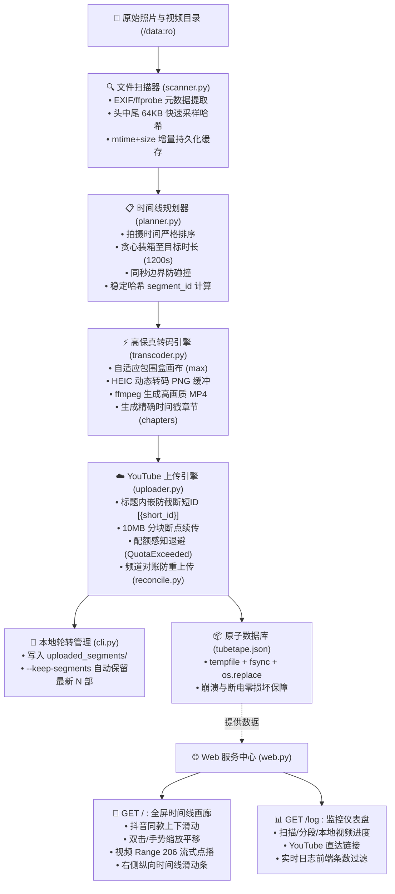

# TubeTape

> **家庭照片与视频的高清时间胶囊**：自动将海量家庭照片、手机实拍与相机视频，按时间线智能聚合成高保真分段视频，安全备份至 YouTube 私人频道；内置抖音同款全屏时间线画廊与实时运行仪表盘。

[](LICENSE)
[](pyproject.toml)
[](https://hub.docker.com/r/chet2026/tubetape)

---

## 目录

- [为什么选择 TubeTape？](#为什么选择-tubetape)
- [核心特性](#核心特性)
- [系统架构与工作流程](#系统架构与工作流程)
- [快速开始](#快速开始)
  - [方式一：Docker Compose（推荐，长期挂机首选）](#方式一docker-compose推荐长期挂机首选)
  - [方式二：Docker CLI 直接运行](#方式二docker-cli-直接运行)
  - [方式三：原生 Python 环境运行](#方式三原生-python-环境运行)
- [Web 交互系统深度指南](#web-交互系统深度指南)
  - [📱 全屏时间线画廊（根路径 `/`）](#-全屏时间线画廊根路径-)
  - [📊 运行控制台与仪表盘（`/log` 与 `/logs`）](#-运行控制台与仪表盘log-与-logs)
  - [🔑 Google YouTube OAuth 授权指南](#-google-youtube-oauth-授权指南)
- [参数完全手册（CLI Options Reference）](#参数完全手册cli-options-reference)
  - [1. 基础与存储参数](#1-基础与存储参数)
  - [2. 时间线与分段规划参数](#2-时间线与分段规划参数)
  - [3. 画质与视频编码参数](#3-画质与视频编码参数)
  - [4. YouTube 与云端参数](#4-youtube-与云端参数)
  - [5. 持续监控（Watch）与去抖参数](#5-持续监控watch与去抖参数)
  - [6. Web 服务与本地分段保留参数](#6-web-服务与本地分段保留参数)
  - [7. 日志与调试参数](#7-日志与调试参数)
  - [常用场景推荐参数组合](#常用场景推荐参数组合)
- [本地数据存储结构与安全规范](#本地数据存储结构与安全规范)
- [常见问题 FAQ](#常见问题-faq)
- [许可证](#许可证)

---

## 为什么选择 TubeTape？

家庭 NAS 或硬盘里存放着成千上万张散乱的照片和零碎视频：
- **存储与容灾成本高**：家庭素材动辄数 TB，本地多盘冷备成本高昂，异地容灾更难维护；商业云盘存在容量上限或昂贵年费。
- **回顾体验差**：零散的照片和短视频躺在目录深处，极少有人愿意翻看几万张静态文件，回忆往往沦为“数字遗物”。
- **云端压缩损伤**：普通云盘或社交相册往往会对视频和照片严重降质压缩。

**TubeTape 的解决方案**：
1. **聚合为时间胶囊**：按照拍摄时间自动将照片与视频智能打包串联为固定时长的长视频（如 20 分钟/片），配以章节时间戳，照片化为动态胶片。
2. **免费无限冷备**：YouTube 支持免费无限存储高画质私人视频（最高支持 8K 60FPS），提供全球顶尖的灾备能力与流媒体回放体验。
3. **免客户端随时随地回放**：无论是电视机、手机、平板还是投影仪，任何支持 YouTube 的设备均可一键点播家庭记录。
4. **内置抖音同款画廊**：即使不依赖云端，TubeTape 本地也提供极致流畅的沉浸式全屏时间线滑动播放器，支持 iPhone HEIC 原图高速渲染与视频流式点播。

---

## 核心特性

- **📱 抖音同款时间线全屏画廊（`/`）**：
  - 纯黑沉浸式全屏界面，支持触屏手势、鼠标滚轮、键盘上下键（`↑`/`↓`）流畅纵向滑动切换。
  - 图片支持多级缩放（双击 2.5 倍缩放、触屏双指捏合缩放、放大后自由平移拖拽）。
  - 视频智能播放：切入即静音自动播放（突破现代浏览器限制），右上角提供全局一键声音开关。
  - 右侧纵向交互式时间线滑动条（Scrubber）：悬浮或拖拽滑块即时显示年月日期浮动气泡，秒级跨越年月定位。
  - 服务端 iPhone HEIC/HEIF 图片自动转码 JPEG 与多级缓存，视频标准 HTTP 206 Partial Content (Range) 分块流式传输。
- **📊 实时运行控制台与仪表盘（`/log`）**：
  - 顶部 Dashboard：已扫描媒体总数与实时扫描进度、时间线全量分片状态（正在构建动态进度条与当前处理文件名、YouTube 视频 ID 直达链接）、本地磁盘保留视频统计与当前任务状态。
  - 下方实时日志流：支持色彩高亮（INFO 蓝、WARN 黄、ERROR 红、DEBUG 灰），前端下拉菜单自由配置显示最近条数（**默认 100 条**，可选 50、100、200、500、全部），支持自动滚动与一键清屏。
- **💾 本地分片智能保留（`--keep-segments`）**：
  - 构建完成的 MP4 文件保存在 `uploaded_segments/` 目录下（非隐藏文件，便于在宿主机或 NAS 中直接访问）。
  - 支持保留最新 $N$ 部视频（默认 $0$ 即传即删节省空间；设置为 $N$ 时按文件修改时间自动淘汰旧分段）。
- **⚡ 零 `.env` 极简配置与 Web OAuth 授权**：
  - 彻底移除环境变量文件，媒体目录在 `docker-compose.yml` 中声明只读挂载即可。
  - 首次启动容器自动进入授权就绪状态，访问 Web 控制台即可一键完成 Google OAuth 授权，凭据自动写盘并无缝继续运行，无需重启容器。
- **🎞️ 高画质自适应转码引擎**：
  - 默认画布模式取分片内所有素材的动态包围盒（`--canvas-mode max`），决不降采样；支持高达 8K（7680x4320）60FPS。
  - 默认采用高保真电影级参数（`--crf 16`，`--x264-preset slow`）。
  - 智能解析 iPhone Live Photos、HEIC/HEIF、MOV、MP4、3GP 等全格式。
- **🔒 防截断短 ID 云端容灾对账**：
  - 视频标题内嵌唯一短哈希 `[{short_id}]`，彻底根除因 YouTube API 截断简介 Marker 导致的云端对账丢失与无限重复上传。
  - 本地数据库即便意外损毁或丢失，TubeTape 也能自动从 YouTube 频道拉取已有列表秒级恢复，零重复上传。
- **🚀 10MB 分块断点续传与配额自愈**：
  - 采用 10MB 分块流式上传（`request.next_chunk()`），遇网络瞬断指数退避重试，绝不重新建片。
  - 遇到 YouTube 每日上传配额耗尽（`quotaExceeded`）自动休眠退避（默认 1 小时），配额刷新后平稳继续。
- **🛡️ 只读源文件与 Docker 平稳停机**：
  - 源照片目录必须只读挂载（`:ro`），TubeTape 绝不修改或删除任何原始素材。
  - 捕获 `SIGTERM`/`SIGINT` 信号安全平稳退出，杜绝 Docker 10 秒超时强制 `SIGKILL` 产生云端孤儿视频。

---

## 系统架构与工作流程



---

## 快速开始

### 方式一：Docker Compose（推荐，长期挂机首选）

这是在 NAS（群晖、威联通、TrueNAS、Unraid）或 Linux 服务器上最推荐的部署方式。

#### 1. 准备工作目录与凭据
在宿主机创建目录，并将从 Google Cloud 下载的 `client_secret.json` 放入其中：
```bash
mkdir -p TubeTape && cd TubeTape

# 将你从 Google Cloud Console 下载的 client_secret.json 拷贝到当前目录
cp /path/to/client_secret.json .
```

#### 2. 创建 `docker-compose.yml`
直接使用仓库提供的配置文件（或创建如下内容），修改你的照片目录路径：
```yaml
services:
  tubetape:
    image: chet2026/tubetape:latest
    container_name: tubetape
    restart: unless-stopped
    ports:
      - "9090:8080"
    environment:
      - TZ=Asia/Shanghai
    volumes:
      # 【必填】将冒号前的路径改为你宿主机照片/视频的实际绝对路径（只读挂载 :ro）
      - /volume1/homes/photos:/data:ro
      # 数据库、日志、OAuth凭据(client_secret.json/token.json)及本地分段视频保存在当前目录
      - ./:/db
    command:
      - --input
      - /data
      - --db
      - /db/tubetape.json
      - --client-secret
      - /db/client_secret.json
      - --timezone
      - Asia/Shanghai
      - --privacy
      - private
      - --max-resolution
      - 3840x2160
      - --segment-duration
      - "1200s"
      - --fps
      - "30"
      - --keep-segments
      - "0"                        # 本地保留构建视频数量：0 上传后即删（默认）；设置为 N 保留最新 N 个
      - --watch                    # 持续监控模式：新照片扔进目录后自动增量打包
      - -v
```

#### 3. 启动并完成一键 Web 授权
```bash
# 启动容器（后台运行）
docker compose up -d
```
1. 打开浏览器访问：`http://<宿主机或NAS_IP>:9090/log`
2. 页面顶部会醒目弹出「🔑 需要完成 Google YouTube 授权」卡片。
3. 点击「🔗 点击前往 Google 账号授权」，在 Google 页面登录并同意权限。
4. **回调保存**：
   - 若在本机运行，会自动回调保存凭据；
   - 若在远程 NAS 上运行，点击授权后浏览器地址栏跳转 `http://localhost:8080/?state=...&code=...`（页面打不开无需理会），**直接复制浏览器地址栏的整条 URL**，粘贴到 Web 卡片输入框中点击「提交凭据」即可。
5. 授权成功后，当前目录自动生成 `token.json`，后台立即开始扫描与同步，**无需重启容器**！

#### 4. 畅享体验
- 访问 `http://<NAS_IP>:9090/`：直接进入沉浸式家庭全屏画廊，上下滑动浏览时光轨迹！
- 访问 `http://<NAS_IP>:9090/log`：查看实时 Dashboard 统计与运行日志。

---

### 方式二：Docker CLI 直接运行

如果你不使用 docker-compose，可以使用纯 docker 命令：

```bash
docker run -d \
  --name tubetape \
  --restart unless-stopped \
  -p 9090:8080 \
  -e TZ=Asia/Shanghai \
  -v /volume1/homes/photos:/data:ro \
  -v /volume1/docker/tubetape:/db \
  chet2026/tubetape:latest \
  --input /data \
  --db /db/tubetape.json \
  --client-secret /db/client_secret.json \
  --timezone Asia/Shanghai \
  --keep-segments 0 \
  --watch -v
```

---

### 方式三：原生 Python 环境运行

适用于开发者或本地调试：

```bash
# 1. 克隆代码库
git clone https://github.com/ouut/TubeTape.git && cd TubeTape

# 2. 安装 Python 运行时依赖（需 Python 3.11+，系统中需已安装 ffmpeg）
pip install .

# 3. 运行程序（默认开启 Web 8080 端口）
python -m tubetape \
  --input /path/to/my/photos \
  --db ./tubetape.json \
  --client-secret ./client_secret.json \
  --keep-segments 3 \
  -v
```
浏览器访问 `http://localhost:8080` 即可使用。

---

## Web 交互系统深度指南

TubeTape 内置了专为大屏与移动端设计的双核心 Web 系统：

### 📱 全屏时间线画廊（根路径 `/`）

通过浏览器打开 `http://<IP>:9090/` 即可进入家庭影像全屏画廊：

1. **抖音同款滑动浏览**：
   - **触屏移动端**：向上滑动切换下一个素材，向下滑动切换上一个素材。
   - **桌面端**：鼠标滚轮向上/向下滚动切换；键盘 `↑` / `↓` 或 `PageUp` / `PageDown` 切换；右下角提供浮动快捷按钮。
   - **虚拟三层 DOM 架构**：内存中仅挂载上一张、当前张、下一张三个渲染容器，无论媒体库有 5,000 张还是 50,000 张照片，滑动均如丝般顺滑，杜绝移动端浏览器内存崩溃。
2. **多级缩放与高清细节检视**：
   - **双击缩放**：双击图片任意位置，以点击点为核心放大至 2.5 倍高清呈现；再次双击还原。
   - **触屏双指捏合（Pinch）**：支持流畅的手势缩放。
   - **拖拽平移**：放大状态下按住鼠标或单指滑动可任意平移画面检视细节。
3. **视频智能播放与全局声音控制**：
   - 滑入视频时**自动静音播放**，完全符合各大浏览器原生 Autoplay 策略；滑出时自动暂停。
   - 顶部提供「🔇 静音 / 🔊 声音」切换开关，开启声音后全局记忆，后续视频自动带声播放。
   - 单击视频画面可暂停/继续播放，底部配有高精度播放进度指示条。
4. **右侧纵向时间线滑动条（Scrubber）**：
   - 屏幕右侧常驻垂直时间轴滑轨，清晰标识素材所跨越的年份与月份分布。
   - 鼠标悬浮或手指拖动滑轨时，左侧实时弹出浮动日期气泡（例如 `📅 2023-10-15 (第 412 / 1,580 个)`）。
   - 释放拖拽或点击滑轨任意高度，画面**毫秒级直达**对应时间点的素材！
5. **高性能服务端转码与流式点播**：
   - **iPhone 原生 HEIC/HEIF 全兼容**：现代浏览器均不支持 HEIC 图片格式。TubeTape 服务端通过 Pillow/pillow-heif 自动读取 EXIF 旋转角度并转码为高画质 JPEG，持久化缓存在 `.preview_cache/`，秒开秒显。
   - **HTTP 206 Partial Content (Range) 流式点播**：视频文件严格按照 Range 协议分块供给（2MB 缓冲块），拖动进度条即可即时 Seek，不占用整片下载带宽。

---

### 📊 运行控制台与仪表盘（`/log` 与 `/logs`）

通过浏览器打开 `http://<IP>:9090/log`：

1. **顶部实时 Dashboard 仪表卡片**：
   - **扫描进度 / 媒体总数**：显示已入库媒体总数；若后台正在扫描，实时展示当前扫描进度计数及正在检查的文件相对路径。
   - **时间线分段 (Segments)**：展示规划的总分段数，以及 `已上传: X | 待构建: Y` 的实时对比。
   - **本地磁盘保留视频**：展示当前存放在 `uploaded_segments/` 目录中的本地构建视频数量，以及配置的 `--keep-segments` 限制。
   - **当前运行任务**：清晰展示后台状态（`idle` 空闲、`scanning` 扫描中、`transcoding` 正在转码、`uploading` 正在上传、`watching` 常驻监听等）。
2. **时间线分段列表 (Timeline Segments)**：
   - 以时间先后顺序清晰罗列每一个时间胶囊分片。
   - **分段标题与区间**：例如 `20240101-100000 - 20240101-102000 [a1b2c3d4e5f6]`。
   - **媒体数量与时长**：展示分段内聚合的照片/视频数量与实际秒数。
   - **动态构建进度**：正在转码的分段会动态显示百分比进度条、已完成文件数（如 `15/45`）及当前正在送入 ffmpeg 处理的素材文件名。
   - **YouTube 视频直达链接**：上传成功后，展示带有播放图标的链接 `▶️ 查看视频 (ID: xxxxx)`，点击直接打开 YouTube 播放。
3. **实时运行日志与条数过滤**：
   - **色彩高亮**：`INFO` 呈现亮蓝、`WARNING` 呈现鲜黄、`ERROR` 呈现亮红、`DEBUG` 呈现灰色。
   - **前端条数过滤**：下拉菜单支持自由选择展示最近日志条数（**默认 100 条**，可选 50 条、100 条、200 条、500 条或全量显示），长期挂机再也不用担心浏览器 DOM 节点过多卡死。
   - **控制开关**：提供「自动滚动：开/关」切换与「清屏」功能。

---

### 🔑 Google YouTube OAuth 授权指南

YouTube API 免费向所有个人开发者开放（每日配额 10,000 units，上传一个视频消耗 1,600 units，每日可上传约 6 部 20 分钟的 4K 高清分片）。

#### 一次性获取 `client_secret.json` 步骤：
1. 访问 [Google Cloud Console](https://console.cloud.google.com/) 创建一个新项目（例如命名为 `My-TubeTape`）。
2. 进入 **API 和服务 → 库**，搜索并启用 **YouTube Data API v3**。
3. 进入 **API 和服务 → OAuth 同意屏幕**：
   - 用户类型选择 **外部 (External)**。
   - 填写应用名称（如 `TubeTape`）与支持邮箱。
   - **测试用户 (Test Users)**：添加你自己的 Google 账号邮箱。
   - 权限范围 (Scopes) 添加：`https://www.googleapis.com/auth/youtube.force-ssl`。
   - 发布状态：个人自用点击 **Publish app（发布应用）** 进入生产状态（生产状态下个人自用无需 Google 商业审核，Refresh Token 永久有效不再过期）。
4. 进入 **API 和服务 → 凭据 → 创建凭据 → OAuth 客户端 ID**：
   - 应用类型选择 **桌面应用 (Desktop App)**。
   - 创建后点击 **下载 JSON**，重命名为 `client_secret.json` 并放入 TubeTape 工作目录。

---

## 参数完全手册（CLI Options Reference）

TubeTape 提供丰富、专业且经过严谨工程校验的命令行参数，所有参数均支持直接在 `docker-compose.yml` 的 `command` 列表中声明，或在终端命令行中使用。

### 1. 基础与存储参数

| 参数名 | 类型 / 取值 | 默认值 | 详细说明 | 实用示例 |
|---|---|---|---|---|
| `--input` | 路径字符串 | `.` | 指定待扫描的照片和视频根目录路径。在 Docker 中映射为挂载目录（如 `/data`）。 | `--input /data` |
| `--db` | 文件路径 | `<input>/tubetape.json` | 核心 JSON 数据库文件路径。存储文件哈希缓存、元数据与已上传视频记录。若未指定，默认保存在输入目录同级。 | `--db /db/tubetape.json` |
| `--client-secret` | 文件路径 | `<db目录>/client_secret.json` | Google Cloud OAuth 客户端密钥文件路径。若未显式指定，默认在数据库同级目录查找。 | `--client-secret /db/client_secret.json` |
| `--login` | 开关标记 | `False` | 纯终端交互式登录流程开关。执行该参数时会启动 OAuth 换取流程，成功生成 `token.json` 后立即退出。 | `--login` |

---

### 2. 时间线与分段规划参数

| 参数名 | 类型 / 取值 | 默认值 | 详细说明 | 实用示例 |
|---|---|---|---|---|
| `--segment-duration` | 时长表达式 | `1h` (3600秒) | 每个视频分段的目标最大时长上限。支持多种时间格式：`1h`、`20m`、`1200s`、`0:20:00`。达到此时长后分片将自动封口。 | `--segment-duration 1200s` |
| `--image-duration` | 时长表达式 / 浮点数 | `3.0` (秒) | 静态照片转换为视频时的持续播放时长。默认每张照片播放 3 秒。 | `--image-duration 2.5` |
| `--timezone` | 时区名称字符串 | 系统本地时区 | 用于解释没有时区信息的照片 EXIF 拍摄时间。支持所有标准 IANA 时区（如 `Asia/Shanghai`、`America/New_York`）。 | `--timezone Asia/Shanghai` |
| `--only-camera-photos` | 开关标记 | `False` | 严格相机素材过滤：仅保留 EXIF 中具备相机制造厂商（`Make`）与型号（`Model`）的照片，自动剔除手机截屏、网络聊天下载图片。 | `--only-camera-photos` |
| `--only-phone-videos` | 开关标记 | `False` | 严格手机视频过滤：仅保留元数据中包含相机厂商信息的手机实拍视频，自动过滤录屏、网络转存或二道压缩视频。 | `--only-phone-videos` |
| `--flush` | 开关标记 | `False` | 强制清空待定队列：正常情况下末尾不足分段时长的文件会被暂存（Pending Queue），加上此参数会强制将剩余素材封口并立即转码上传。 | `--flush` |

---

### 3. 画质与视频编码参数

| 参数名 | 类型 / 取值 | 默认值 | 详细说明 | 实用示例 |
|---|---|---|---|---|
| `--crf` | 整数 (≥ 0) | `16` | x264 编码恒定速率因子（CRF）。数值越小画质越好，16 属于视觉无损级别的电影级高保真参数。推荐范围 16~23。 | `--crf 18` |
| `--max-resolution` | 分辨率 `宽x高` | `7680x4320` | 画布上限包围盒。默认 8K（7680x4320）。TubeTape 绝不上采样；全片素材不超过 4K 时输出 4K，不超过 1080p 时输出 1080p。 | `--max-resolution 3840x2160` |
| `--canvas-mode` | `max` 或 `first` | `max` | 分片画布决议模式：`max` 会计算分片内所有照片视频的最大包围盒，确保任何纵向/横向素材均不被降采样；`first` 则以第一个素材分辨率为准。 | `--canvas-mode max` |
| `--fps` | 整数 (> 0) | `60` | 输出视频帧率。默认 60 帧，能完美保留现代手机录制的 60FPS 流畅动态；若对转码速度敏感可设为 30。 | `--fps 30` |
| `--x264-preset` | 编码预设 | `slow` | ffmpeg x264 压缩预设。可选：`ultrafast`、`superfast`、`veryfast`、`faster`、`fast`、`medium`、`slow`、`slower`、`veryslow`。越慢压缩率与画质越优。 | `--x264-preset medium` |
| `--ken-burns` | 开关标记 | `False` | 动态运镜效果：对静态照片启用缓慢平移与缩放的 Ken Burns 滤镜，使照片播放更具电影纪录片感。 | `--ken-burns` |

---

### 4. YouTube 与云端参数

| 参数名 | 类型 / 取值 | 默认值 | 详细说明 | 实用示例 |
|---|---|---|---|---|
| `--privacy` | `private` 或 `unlisted` | `private` | 上传到 YouTube 的视频隐私等级：`private` 为私人视频（仅自己可见），`unlisted` 为不公开视频（拥有链接者可见）。 | `--privacy private` |
| `--playlist` | 播放列表 ID 字符串 | `None` | 上传成功后自动归入指定的 YouTube 播放列表（Playlist ID）。分片将按拍摄时间顺序追加。 | `--playlist PLxxxxxxxx` |
| `--quota-backoff` | 时长表达式 | `1h` (3600秒) | 当 YouTube API 返回上传配额耗尽（`quotaExceeded`）时，后台休眠退避的时长。支持 `1h`、`30m` 等。 | `--quota-backoff 1h` |

---

### 5. 持续监控（Watch）与去抖参数

| 参数名 | 类型 / 取值 | 默认值 | 详细说明 | 实用示例 |
|---|---|---|---|---|
| `--watch` / `--no-watch` | 布尔开关 | `--watch` (开启) | 持续文件监控模式。开启后利用 watchdog（inotify/FSEvents）长效监听目录；传入 `--no-watch` 则处理完现有文件后退出。 | `--no-watch` |
| `--quiet-period` | 时长表达式 | `10m` (600秒) | 监控模式静默等待期：检测到新文件添加后，等待 10 分钟没有新写入事件才触发处理，防止照片还在网络传输/拷贝一半就被提前切片。 | `--quiet-period 5m` |
| `--poll-interval` | 时长表达式 | `30s` (30秒) | 监控模式内部事件驱动轮询 tick 周期。 | `--poll-interval 15s` |
| `--mtime-interval` | 时长表达式 | `1h` (3600秒) | 目录 mtime 安全网兜底扫描间隔：定期执行轻量级巡检，用于捕获某些网络共享存储（NFS/SMB）可能丢失的文件系统事件。 | `--mtime-interval 30m` |

---

### 6. Web 服务与本地分段保留参数

| 参数名 | 类型 / 取值 | 默认值 | 详细说明 | 实用示例 |
|---|---|---|---|---|
| `--web-port` | 整数 (0~65535) | `8080` | 内置 Web 服务监听端口（画廊 `/`、仪表盘 `/log`）。传入 `0` 表示彻底禁用内置 Web 服务。 | `--web-port 8080` |
| `--keep-segments` | 整数 (≥ 0) | `0` | 上传成功后在本地 `uploaded_segments/` 目录保留的最新分段视频数量。`0` 表示即传即删（不占磁盘）；设置为 $N$（如 `3`）时仅保留最新 $N$ 个视频，自动轮转删除旧视频。 | `--keep-segments 3` |

---

### 7. 日志与调试参数

| 参数名 | 类型 / 取值 | 默认值 | 详细说明 | 实用示例 |
|---|---|---|---|---|
| `-v` / `--verbose` | 计数累加 | `0` (仅 WARNING+) | 终端日志详细度。不传显示 WARNING+；一个 `-v` 显示 INFO 信息；两个 `-vv` 显示最详尽的底层 DEBUG 信息（含哈希缓存命中情况）。 | `-v` 或 `-vv` |
| `--log-file` | 文件路径 | `<db>.log` | 详细 DEBUG 审计日志输出路径。默认生成在 `<db路径>.log`，不受 `-v` 控制，全量持久化所有纳秒级哈希、转码与网络事件。 | `--log-file /db/audit.log` |
| `--dry-run` | 开关标记 | `False` | 演练预检模式：执行完整的目录扫描、元数据解析与分片规划计算，但不调用 ffmpeg、不上载云端、不写数据库。安全零风险。 | `--dry-run` |

---

### 常用场景推荐参数组合

#### 1. 家庭 NAS 长期挂机（兼顾 4K 画质与极速备份）
```bash
docker compose up -d
# 对应参数:
# --segment-duration 1200s --max-resolution 3840x2160 --fps 30 --crf 18 --keep-segments 0 --watch -v
```
- 分片时长 20 分钟（方便单片回放与 YouTube 处理）；
- 画布 4K 30FPS，在保证极高视觉质量的同时大幅减少 NAS CPU 负担；
- 上传后不占本地磁盘。

#### 2. 极致发烧友归档（8K 60FPS 影院级母带参数）
```bash
python -m tubetape \
  --input /photos --segment-duration 1h \
  --max-resolution 7680x4320 --fps 60 --crf 16 --x264-preset slow \
  --keep-segments 5 --watch -v
```
- 保留最新 5 部高清分段在本地 `uploaded_segments/`，其余同步至 YouTube 备份。

#### 3. 过滤非家庭实拍（丢弃截图与转发文件）
```bash
python -m tubetape \
  --input /photos \
  --only-camera-photos --only-phone-videos \
  --watch -v
```

---

## 本地数据存储结构与安全规范

当 TubeTape 启动后，宿主机工作目录的典型文件布局如下：

```
TubeTape/
├── docker-compose.yml           # 容器配置
├── client_secret.json           # [只读] Google Cloud OAuth 客户端文件
├── token.json                   # [读写 0600] 授权后的 YouTube 凭据（程序自动刷新）
├── tubetape.json                # [读写] 核心数据库（原子写入，含扫描缓存与已传记录）
├── tubetape.json.log            # [读写] 详细 DEBUG 审计日志
├── uploaded_segments/           # [读写] 本地分段视频目录（由 --keep-segments 管理）
│   ├── 20240101-100000 - 20240101-102000 [a1b2c3d4e5f6].mp4
│   └── 20240101-102000 - 20240101-104000 [7890abcdef12].mp4
└── .preview_cache/              # [内部缓存] HEIC/HEIF 图片转换后的缩略缓存
```

### 🛡️ 源文件绝对保护原则
- 原始家庭媒体目录在容器内**必须只读挂载**（`:ro`）。
- TubeTape 从代码层面只有读操作（读取 EXIF、计算采样哈希、提取视频帧），任何转码临时文件均在隔离目录生成，**绝对不会修改、覆盖或删除用户的原始照片和视频**。

---

## 常见问题 FAQ

### Q1：YouTube 上传配额用完了会怎样？
- YouTube Data API 默认给每个项目每日 10,000 units 配额。
- 每次上传一个视频消耗约 1,600 units，因此每天大约能上传 6 个分段（若每片 20 分钟，每天可同步 2 小时的高清内容）。
- 当遇到配额上限时，TubeTape 会记录 `YouTube quota exhausted` 并自动休眠退避（默认 1 小时）。次日太平洋时间午夜 Google 配额自动刷新后，TubeTape 会平稳自动继续上传，**无需人工干预**。

### Q2：为什么视频标题里有 `[{short_id}]` 这种奇怪字符？
- 这是 TubeTape 独创的**防截断云端对账标记**。
- YouTube API 会在视频发布后对长简介执行截断或清洗，导致传统的简介 Marker 对账机制丢失。
- 将分片唯一指纹短哈希（`sha256(file_ids + params)[:16]`）嵌入标题末尾，永远不会被截断。本地哪怕数据库完全丢失或更换新电脑，TubeTape 联网瞬间就能比对出云端已存在哪些分片，**绝对不会重复上传**。

### Q3：为什么视频简介里的时间戳可以点击跳转？
- TubeTape 在转码过程中精确记录了每一张照片与每一段视频在合成片中的准确起止秒数。
- 生成的简介严格符合 YouTube 播放器识别规范（例如 `0:00 20240101-120000`、`0:03 20240101-120003`）。在 YouTube 播放器中，这些时间戳全量可点击直接跳播。

### Q4：多台设备或朋友能共用我的 `client_secret.json` 吗？
- **强烈不建议**。因为 YouTube API 的配额是绑定在 Google Cloud 项目上的，如果多人共用同一个 `client_secret.json`，每天 10,000 点配额会被互相抢光。
- 建议每个使用者独立花 3 分钟按照本指南创建属于自己的 GCP 项目与客户端密钥。

---

## 许可证

本项目基于 [MIT 许可证](LICENSE) 开源。欢迎提交 Issue 与 Pull Request 共同完善！
