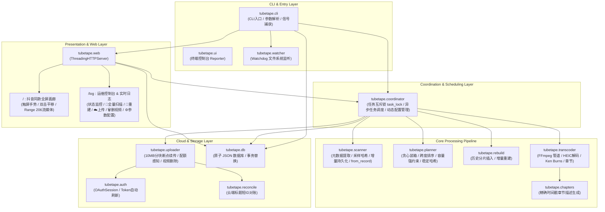
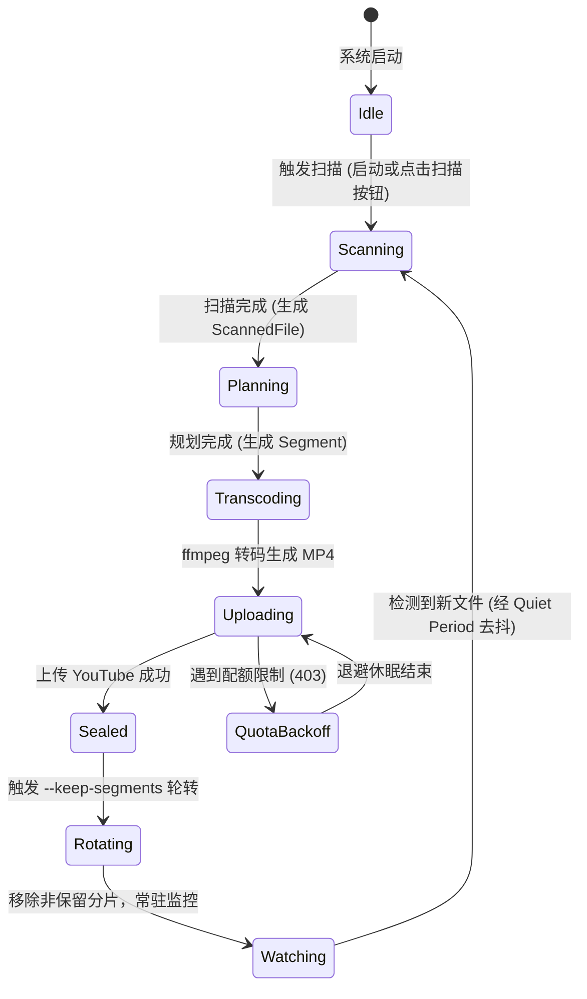

# TubeTape 核心架构与开发实现文档

> 本文档基于 TubeTape 真实代码库从零编写，系统性阐述系统架构设计、核心模块实现、关键算法与数据结构、数据持久化规范以及测试验证体系。

---

## 目录

- [1. 系统设计原则与哲学](#1-系统设计原则与哲学)
- [2. 系统全局架构与模块拓扑](#2-系统全局架构与模块拓扑)
- [3. 数据库模型与存储规范 (db.py)](#3-数据库模型与存储规范-dbpy)
- [4. 核心流水线实现与算法拆解](#4-核心流水线实现与算法拆解)
  - [4.1 媒体扫描与快速采样哈希 (scanner.py)](#41-媒体扫描与快速采样哈希-scannerpy)
  - [4.2 时间线贪心分片与容量强约束 (planner.py)](#42-时间线贪心分片与容量强约束-plannerpy)
  - [4.3 增量重建机制 (rebuild.py)](#43-增量重建机制-rebuildpy)
  - [4.4 高保真视频转码引擎 (transcoder.py)](#44-高保真视频转码引擎-transcoderpy)
  - [4.5 视频章节与时间戳生成 (chapters.py)](#45-视频章节与时间戳生成-chapterspy)
  - [4.6 云端对账与防截断短 ID 容灾 (reconcile.py)](#46-云端对账与防截断短-id-容灾-reconcilepy)
  - [4.7 YouTube 分块上传与配额自愈 (uploader.py)](#47-youtube-分块上传与配额自愈-uploaderpy)
  - [4.8 认证流与 Token 自愈 (auth.py)](#48-认证流与-token-自愈-authpy)
  - [4.9 核心协同调度器 (coordinator.py)](#49-核心协同调度器-coordinatorpy)
  - [4.10 动态文件系统监控 (watcher.py)](#410-动态文件系统监控-watcherpy)
  - [4.11 Web 交互系统与流媒体引擎 (web.py)](#411-web-交互系统与流媒体引擎-webpy)
  - [4.12 命令行入口与管线编排 (cli.py)](#412-命令行入口与管线编排-clipy)
- [5. 数据生命周期与状态流转](#5-数据生命周期与状态流转)
- [6. 测试体系与质量保障](#6-测试体系与质量保障)
- [7. 构建、打包与容器化规范](#7-构建打包与容器化规范)

---

## 1. 系统设计原则与哲学

TubeTape 的设计旨在解决家庭媒体海量数据长期保存与安全备份问题，遵循以下工程哲学：

1. **归档优先 (Archive-First)**：
   最终每一个文件恰好属于一个时间段分片，分片严格按照真实拍摄时间先后单调递增，内容自洽且完整。
2. **源文件不可变 (Source Immutability)**：
   输入的源文件目录以只读方式挂载或处理，系统代码中绝不包含任何对原始照片/视频的修改或删除逻辑。
3. **分片不可变与按需重建 (Immutable Segments & Rebuild)**：
   由于 YouTube 不支持替换已上传视频的底层文件，更新分片必须遵循“先上传新片，新片落盘入库成功后再删除/废弃旧片”原则，杜绝更新失败导致数据断档。
4. **确定性与无状态容灾 (Stateless Cloud Reconciliation)**：
   本地分片 ID 由素材集合与参数哈希决定；视频标题内嵌防截断短哈希。本地数据库丢失时，依靠云端元数据即可重建索引，零重复上传。
5. **增量自愈与零中断保护 (Resilience & Self-Healing)**：
   Token 失效自动后台刷新；网络断流 10MB 分块平滑续传；YouTube 配额耗尽自动退避；扫描过程中阶段性原子保存，避免长任务中断丢失状态。
6. **Docker 平稳停机防孤儿视频 (Clean Graceful Shutdown)**：
   捕获 `SIGTERM`/`SIGINT` 信号安全退出，停机阶段不强行开启新转码，避免 Docker 10 秒超时 `SIGKILL` 产生未录入数据库的孤儿视频。
7. **零外部框架依赖 (Zero Framework Overhead)**：
   Web 服务基于 Python 原生 `http.server.ThreadingHTTPServer`，不引入大型异步 Web 框架，确保在 NAS 等低配硬件上极低常驻内存占用与零网络端口死锁。

---

## 2. 系统全局架构与模块拓扑



### 核心模块职责映射表

| 模块路径 | 职责定位 | 关键类与核心函数 |
|---|---|---|
| `tubetape.db` | 原子单文件持久化数据库 | `Database`、`DatabaseError`、`SCHEMA_VERSION` |
| `tubetape.scanner` | 媒体扫描、格式探测、采样哈希与恢复 | `scan()`、`sample_hash()`、`ScannedFile`、`probe_video()`、`ScannedFile.from_record()` |
| `tubetape.planner` | 时间线分片规划、容量约束与稳定指纹 | `plan()`、`compute_segment_id()`、`Segment`、`Plan`、`greedy_pack()` |
| `tubetape.rebuild` | 增量分片插入与两阶段重建替换 | `rebuild_segment()`、`Rebuilder` |
| `tubetape.transcoder` | ffmpeg 管道装配、转码执行与进度回调 | `transcode_segment()`、`TranscodeConfig`、`compute_canvas()` |
| `tubetape.chapters` | 章节与精准跳转时间戳生成 | `chapters_text()` |
| `tubetape.auth` | Google OAuth 交互、Token 自动刷新 | `ensure_credentials()`、`OAuthSession`、`headless_oauth_flow()` |
| `tubetape.reconcile` | 云端频道对账与容灾自愈 | `fetch_remote_index()` |
| `tubetape.uploader` | YouTube 分块上传、配额感知与视频删除 | `YouTubeUploader`、`QuotaExceededError`、`delete_video()` |
| `tubetape.coordinator` | 全局异步任务调度、互斥锁与动态配置管理 | `AppCoordinator`、`rotate_uploaded_segments()`、`find_local_segment_file()` |
| `tubetape.watcher` | 文件系统动态监听与静默去抖 | `MediaWatcher`、`MtimeScanner` |
| `tubetape.web` | 画廊、仪表盘、REST API 与 Range 206 串流 | `WebServer`、`_RequestHandler`、`set_app_coordinator()` |
| `tubetape.cli` | 命令行参数解析、生命周期编排与停机 | `main()`、`run_pipeline()`、`build_parser()` |

---

## 3. 数据库模型与存储规范 (db.py)

TubeTape 采用纯标准库实现的单文件 JSON 数据库。为确保强一致性与断电零损坏，数据持久化采用了 **原子替换写入机制**。

### 3.1 原子写入保证
```python
# db.py 写入逻辑核心
fd, tmp_path = tempfile.mkstemp(dir=directory, prefix=".tubetape-", suffix=".tmp")
try:
    with os.fdopen(fd, "w", encoding="utf-8") as handle:
        handle.write(payload)
        handle.flush()
        os.fsync(handle.fileno())  # 确保物理落盘
    os.replace(tmp_path, target)   # POSIX 原生原子重命名
except BaseException:
    os.unlink(tmp_path)
    raise
```

### 3.2 Schema V1 规范定义
```json
{
  "version": 1,
  "files": {
    "<file_id>": {
      "path": "2024/05/IMG_1234.JPG",
      "name": "IMG_1234.JPG",
      "type": "image",
      "captured_at_utc": "2024-05-01T12:00:00Z",
      "resolution": "4032x3024",
      "duration_seconds": 3.0,
      "size_bytes": 4194304,
      "sha256": "4a7b...",
      "location": {"lat": 31.2304, "lng": 121.4737},
      "missing_meta": false
    }
  },
  "segments": {
    "<segment_id>": {
      "file_ids": ["<file_id_1>", "<file_id_2>"],
      "range": ["2024-05-01T12:00:00Z", "2024-05-01T12:20:00Z"],
      "duration_seconds": 1200.0,
      "output_path": "/db/uploaded_segments/20240501-120000 - 20240501-122000 [a1b2c3d4e5f6].mp4",
      "youtube_video_id": "dQw4w9WgXcQ",
      "previous_video_ids": [],
      "status": "sealed",
      "chapters": [["0:00", "20240501-120000"], ["0:03", "20240501-120003"]],
      "last_rebuilt_at": null,
      "attempts": 1,
      "error": null
    }
  }
}
```

---

## 4. 核心流水线实现与算法拆解

### 4.1 媒体扫描与快速采样哈希 (scanner.py)

#### 支持的格式矩阵
- **图片**：`.jpg`、`.jpeg`、`.png`、`.heic`、`.heif`、`.tif`、`.tiff`、`.webp`、`.bmp`。
- **视频**：`.mp4`、`.mov`、`.m4v`、`.avi`、`.mkv`、`.webm`、`.3gp`。

#### 快速采样哈希算法 (Fast Sample Hash)
对于数十 GB 的超大视频，全量读取计算 SHA-256 会导致巨额磁盘 I/O。TubeTape 实现了头中尾采样哈希算法：
1. 若文件大小 $\le 192\text{ KB}$，整读计算 SHA-256。
2. 若文件大小 $> 192\text{ KB}$，分别抽取：
   - 头部 $64\text{ KB}$
   - 中部 $64\text{ KB}$（offset = `(size - 64KB) // 2`）
   - 尾部 $64\text{ KB}$（offset = `size - 64KB`）
3. 将三段切片与 8 字节大端整数文件尺寸拼接后计算 SHA-256。
**效果**：首次全量冷扫描吞吐量提升约 10 倍；读取量从数百 GB 骤降至数 GB。

#### 路径集合智能比对与精准增量构建 (Path Set Check & Precise Incremental)
扫描器采用路径集合比对与精准增量机制，彻底摒弃文件级 `(mtime + size)` 缓存：
- **启动智能判断**：通过目录快速收集磁盘媒体路径集合 `disk_paths`，并与数据库已收录集合 `db_paths` 比对。若两者完全一致，跳过文件探测与哈希计算，直接从数据库秒级恢复所有文件对象进入 watch 监听。
- **精准增量构建**：当检测到路径集合不一致时，通过差集 `disk_paths - db_paths` 精准识别新增媒体，仅对新增文件提取元数据与采样哈希；删除失效文件记录 `db_paths - disk_paths`；对存量未变动文件 `disk_paths & db_paths` 直接通过 `ScannedFile.from_record` 恢复，不重复读取磁盘。
- **强制全量扫描 (`--force-scan`)**：支持 `--force-scan` 强制重新计算与构建全量文件的元数据。
- 扫描期间每 1,000 个文件或每 30 秒阶段性保存一次数据库，杜绝中途强退导致已扫描数据丢失。

---

### 4.2 时间线贪心分片与不可变追加规划 (planner.py)

#### 确定性排序规则
所有素材按如下复合键严格升序排列：
1. **无拍摄时间素材排在最前**：对于缺少 EXIF/视频元数据且无法推导日期的素材，统一置于时间线最前端，并以 `file_id`（采样哈希）字典序作为次级排序键，确保绝对确定性。
2. **有拍摄时间素材按拍摄时间升序**：以 UTC 秒数 `captured_epoch` 排序，同秒素材以 `file_id` 打破平局。

#### 稳定分片 ID (Segment ID) 与标题规范
- 分片 ID 不依赖执行时间或随机数，仅由分片内文件哈希与转码配置参数严格决定：
  $$\text{segment\_id} = \text{SHA256}\left(\sum_{f \in \text{sorted(file\_ids)}} f + \sum_{p \in \text{params}} p\right)$$
- **标题命名规范**：
  - 含有拍摄时间的常规分片：`{start_ts} - {end_ts} [{short_id}]`（如 `20140513-062834 - 20141001-015345 [8ebbe961761892c9]`）。
  - 若分片内所有素材均缺失拍摄时间，紧凑命名为 `19700101_000000-19700101_000000_[{short_id}]`（短横线与下划线无空格紧凑排列）。

#### 不可变追加规划体系 (Append-Only Immutable Planning)
为彻底杜绝增量扫描时老分片被动重新规划、级联重建与 YouTube 上传配额雪崩，TubeTape 确立了**历史分片永久不可变**的核心准则：
1. **已封板分片免扰**：已存在于数据库中的已封板（`sealed`）分片，其素材列表与分片定义永不被增量扫描修改或拆分。
2. **前沿文件动态入队**：仅当新增素材的拍摄时间 $\ge$ 历史已封板分片的最大时间戳时，才视为时间线最前沿的新鲜增量，追加至末尾的 `pending` 待封板分片；当达到目标时长或用户执行 `--flush` 时，予以封板。
3. **历史回填与无日期素材独立成片**：若用户导入了更早年份的历史素材（拍摄时间 $<$ 历史最大时间戳）或无拍摄时间素材，系统绝不打散历史分片，而是将其归集为全新的独立分片并立即封板，形成自洽的新视频。
4. **单文件超长防护**：若单个素材时长本身超过 `segment_duration`，算法将其单独独立成片，允许单片时长自然超出设定阈值，保障素材完整性。

---

### 4.3 增量重建机制 (rebuild.py)

当用户向过去日期的文件夹中追加历史老照片时，TubeTape 不会打乱后续所有分片，而是执行局部重构：
1. 识别包含该时间戳的历史分片 $S_{\text{old}}$。
2. 将老分片内原有素材与新插入素材合并，规划为重建分片 $S_{\text{new}}$，并标记 `replaces_segment_id = S_old.segment_id`。
3. 转码引擎为 $S_{\text{new}}$ 生成视频并上传至 YouTube。
4. **两阶段提交**：只有当 $S_{\text{new}}$ 成功在 YouTube 产生新的 `video_id` 且在本地数据库持久化后，系统才调用 YouTube API 删除废弃的 $S_{\text{old}}$ 视频。若云端删除失败，仅记入日志，不阻塞流水线。

---

### 4.4 高保真视频转码引擎 (transcoder.py)

#### 自适应包围盒画布 (Bounding Box Canvas)
- 当 `--canvas-mode max` 时，动态扫描分片内所有静态照片与视频的分辨率：
  $$W_{\text{canvas}} = \min(\max_{i} W_i, W_{\text{max\_res}}), \quad H_{\text{canvas}} = \min(\max_{i} H_i, H_{\text{max\_res}})$$
- 确保输出符合 16:9 / 4:3 像素对齐（偶数化），对横屏与竖屏混排场景自动加黑边居中填充，素材本身绝不降采样。

#### iPhone HEIC 转码桥接
由于大多数标准 Linux ffmpeg 发行版并未编译 `libheif`，转码器在处理 HEIC/HEIF 图片时：
- 先通过 Python `Pillow` + `pillow-heif` 将其解码为临时无损 PNG 图像。
- 将临时 PNG 送入 ffmpeg 的 concat demuxer 管道，彻底避开底层编解码器缺失问题。

#### Ken Burns 运镜滤镜生成
若开启 `--ken-burns`，为静态照片生成平滑的缩放平移变换滤镜：
```
zoompan=z='min(zoom+0.0015,1.25)':d=180:x='iw/2-(iw/zoom/2)':y='ih/2-(ih/zoom/2)':s=3840x2160:fps=60
```

#### 分片转码断点续建与暂存机制 (Resumable Transcoding & Staging)
为防止长视频转码因进程中断、机器重启或 Docker 停机导致耗费的高额 CPU/GPU 算力付诸东流，`transcoder.py` 引入了细粒度切片级断点续建与暂存机制：
- **隐藏工作目录**：在最终输出视频同级目录下，为每个分片分配独立的隐藏 staging 目录 `.staging_{out_base}`（例如 `.staging_20240501-120000 - 20240501-122000 [8ebbe961761892c9].mp4`）。
- **切片命名规范**：各子媒体（照片/视频）首先按序转码为独立片段文件，命名为 `clip_{index:04d}_{file_id[:12]}.mp4`。
- **原子写入防护**：切片转码时先输出至 `clip_....tmp.mp4`，编码成功完成且非空后原子重命名为正式切片文件，彻底杜绝转码中途被中断留下破损文件。
- **断点自动复用**：当重新启动或重试转码时，转码引擎优先扫描 staging 目录。若对应的 `clip_....mp4` 已存在且文件大小 $> 1024$ 字节，直接跳过转码，复用已有切片并触发进度通知 `[Cached] Resumed clip X/Y`。
- **快速拼接与清理**：所有切片准备就绪后，通过 ffmpeg concat demuxer 执行极速流级拼接（Stream Copy / Re-mux），先写入临时输出文件再原子替换至目标 `output_path`；成功完成落盘后，自动使用 `shutil.rmtree` 彻底清理隐藏 staging 目录。

---

### 4.5 视频统计简介与时间戳生成 (chapters.py)

TubeTape 在 YouTube 视频简介中输出纯净统计与纯时长列表（通过 `build_segment_description` 构造），彻底摒弃冗余文件名与污染标记：
1. **聚合统计概要**：
   ```text
   Photos: 210 | Videos: 4 | Total Duration: 12:57
   ```
2. **纯视频时长清单（按构建顺序）**：
   ```text
   1. 01:23
   2. 00:45
   3. 02:10
   4. 00:30
   ```
   仅展示按顺序播放的各个子视频纯时长（`1. M:SS`），不包含任何本地文件名，保护隐私且界面清爽极简。
3. **播放器章节兼容 (`chapters_text`)**：
   内部同时维护从 `0:00` 开始的单调递增时间戳映射，可直接为第三方播放器或 YouTube 播放器渲染精确的时间戳跳转。

---

### 4.6 云端对账与防截断短 ID 容灾 (reconcile.py)

#### 标题内嵌防截断短 ID
视频标题命名规则严格定义为：
```
{start_ts} - {end_ts} [{short_id}]
```
其中 `short_id = segment_id[:16]`。对于全无时间戳的素材分段，使用紧凑无空格格式：
```
19700101_000000-19700101_000000_[{short_id}]
```
- **背景**：YouTube Data API 会自动清洗并截断过长的视频简介，导致存放在简介末尾的 Marker 丢失。
- **机制**：标题尾部的短 ID 永不被截断。`fetch_remote_index` 通过 `channels.list` 与 `playlistItems.list` 仅拉取标题文本，即可在本地库缺失时自动恢复映射并跳过已传分片。

---

### 4.7 YouTube 分块上传与配额自愈 (uploader.py)

#### 10MB 分块断点续传 (Resumable Chunking)
使用 Google API 的 `MediaFileUpload(..., resumable=True, chunksize=10*1024*1024)`：
```python
response = None
while response is None:
    status, response = request.next_chunk()
    if status:
        _logger.debug("uploaded %d/%d bytes (%.1f%%)", status.resumable_progress, status.total_size, status.progress() * 100)
```
遭遇网络瞬断时触发指数退避，在当前断点直接重试下一个 10MB 分块，避免重新发起长视频建片。

#### 配额耗尽感知 (Quota Exhaustion Handling)
捕获 `googleapiclient.errors.HttpError`：
- 若错误码为 403 且包含 `quotaExceeded`，抛出内部 `QuotaExceededError`。
- 上层流水线自动保存数据库，设置休眠退避（默认 1 小时），返回退出码 `_EXIT_QUOTA = 2`。

#### 云端视频删除 (`delete_video`)
调用 YouTube API `youtube.videos().delete(id=video_id).execute()` 实现云端物理删除，支持静默重试与 404 已删除幂等容错。

---

### 4.8 认证流与 Token 自愈 (auth.py)

1. **统一门面 `ensure_credentials`**：
   - 检查 `token.json` 存在性。
   - 校验是否过期：若凭据过期且具备 `refresh_token`，自动调用 `creds.refresh(Request())` 刷新，并将新凭据以 `0600` 文件权限持久化写回磁盘。
2. **双模授权引擎 `OAuthSession`**：
   - 维护内置 state 与 flow。
   - 既支持纯终端命令行 `--login` 交互式输入，也支持 Web 容器环境无头等待授权。

---

### 4.9 核心协同调度器 (coordinator.py)

`AppCoordinator` 是整个运行时的指挥枢纽，负责后台异步任务编排、互斥执行锁、动态配置热更新及本地视频轮转：

#### 1. 全局任务互斥锁 (`task_lock`)
为防止用户在 Web 界面同时点击“全量扫描”与“重新构建”导致 ffmpeg 资源争抢与数据库并发脏写，`coordinator` 实现了 `task_lock = threading.Lock()`。
所有异步操作统一通过互斥锁申请；若有任务正在执行，后续操作直接返回 400 提示友好错误。

#### 2. 核心异步动作调度
- **`trigger_scan()`**：启动后台守护线程，执行磁盘扫描 -> 规划 -> 转码 -> 轮转全流程。
- **`rebuild_segment(segment_id)`**：针对指定分片提取素材，原地调用 ffmpeg 重新压制，并在非 `--no-upload` 模式下直接上传。
- **`upload_segment(segment_id)`**：检查 `uploaded_segments/` 目录下是否存在该分片已有的 MP4，若存在则跳过转码直接执行断点续传。
- **`delete_youtube_video(segment_id)`**：调用 YouTube API 删除云端视频，并同步重置本地数据库状态为待处理。

#### 3. 动态配置管理与持久化 (`tubetape.json`)
- 支持在运行时动态热更新参数。
- 维护 `FINGERPRINT_PARAMS` 集合：
  ```python
  FINGERPRINT_PARAMS = frozenset([
      "segment_duration", "image_duration", "crf",
      "max_resolution", "canvas_mode", "fps",
      "x264_preset", "ken_burns",
  ])
  ```
- 修改配置时自动比对受影响字段，若涉及指纹字段则向 Web 界面返回风险提示。配置变更立即物理强原子落盘至 `<db_dir>/tubetape.json` 的 `config` 键，下一次程序启动时自动优先载入。

#### 4. 本地分片轮转管理 (`rotate_uploaded_segments`)
- 扫描 `<db_dir>/uploaded_segments/` 目录中的所有非隐藏 `.mp4` 文件。
- 按文件修改时间 `st_mtime` 倒序排列，保留最新的 $N$ 个文件，超出的旧文件自动执行安全清理。

---

### 4.10 动态文件系统监控 (watcher.py)

基于 `watchdog.observers.Observer` 监听目录变动：
- **Quiet Period 去抖动**：检测到变动后，必须维持 10 分钟无新写入才触发构建，防止素材尚在网络写入途中被截断。
- **mtime 兜底巡检**：默认每 10 分钟（可通过 `--mtime-interval` 自定义配置，如 10m/1h）触发一次目录修改时间巡检，作为 inotify/FSEvents 在特定网络文件系统（NFS/CIFS）下的安全兜底保障。

---

### 4.11 Web 交互系统与流媒体引擎 (web.py)

`web.py` 在独立守护线程中运行 `ThreadingHTTPServer`，提供完整的单页应用与流媒体支持。

#### 1. 路由与 API 拓扑
- `GET /`：全屏时间线画廊 HTML（分段优先导航，支持顶部下拉切分段、首尾平滑穿梭与真实绝对路径复制）。
- `GET /log` 与 `GET /logs`：仪表盘与实时日志控制台 HTML。
- `GET /getbytime/{segment_id}/{minute}/{second}`：精确时间戳媒体直达查看器（展示匹配素材、宿主机真实物理路径、一键复制与流媒体播放；支持 `?raw=1` 重定向与 `?format=json` 元数据响应）。
- `GET /api/segments`：获取所有规划分段的摘要列表（分段 ID、起止跨度、素材数、时长、状态、YouTube 视频 ID 与本地路径）。
- `GET /api/segment/items?id=...`：获取指定分段内的所有媒体明细（含物理绝对路径 `abs_path`、相对路径、类型、拍摄时间、时长与分辨率）。
- `GET /api/status`：核心运行状态与当前任务 JSON。
- `GET /api/dashboard`：包含扫描统计、分段列表、构建进度、本地保留视频统计及分段可用动作的综合大屏接口。
- `GET /api/config`：获取当前运行配置及指纹参数清单。
- `POST /api/config`：动态更新运行参数并保存至 `tubetape.json`。
- `POST /api/scan/start`：异步触发全量扫描任务。
- `POST /api/segment/rebuild`：异步触发指定分片重新构建。
- `POST /api/segment/upload`：异步触发指定分片本地视频直传。
- `POST /api/segment/delete_youtube`：调用 API 删除云端对应视频。
- `GET /api/media/summary`：时间线年月分布统计（支持侧边栏 Scrubber）。
- `GET /api/media/items`：按时间线分页拉取媒体元数据。
- `GET /api/media/view?id=...`：高清图片展示接口（支持 HEIC 转码缓存与路径穿越防护）。
- `GET /api/media/stream?id=...`：视频流点播接口（实现 HTTP 206 Range 协议）。
- `POST /api/auth/submit`：OAuth 授权凭据提交接口。
- `GET /api/logs`：增量日志流拉取接口。

#### 2. HTTP 206 Partial Content (Range) 实现
```python
# Range 头部解析与分块供给
match = re.match(r"bytes=(\d+)-(\d*)", range_header)
if match:
    start = int(match.group(1))
    end = int(match.group(2)) if match.group(2) else min(start + 2*1024*1024 - 1, file_size - 1)
    length = end - start + 1
    self.send_response(206)
    self.send_header("Content-Range", f"bytes {start}-{end}/{file_size}")
    self.send_header("Content-Length", str(length))
    self.send_header("Accept-Ranges", "bytes")
    self.end_headers()
    # 64KB 步长向客户端管道写出
```

#### 3. 路径穿越安全防护 (Path Traversal Protection)
所有媒体请求均强制进行目录前缀校验：
```python
abs_path = os.path.abspath(os.path.join(media_dir, rel_path))
if not abs_path.startswith(os.path.abspath(media_dir)):
    return None, None  # 拒绝访问 media_dir 外部文件
```

#### 4. 画廊分片多源聚合与动态规划降级 (Gallery Segment Aggregation & Dynamic Fallback)
为了彻底解决画廊在首启扫描后未封板、后台转码中或分片尚未写入数据库时的“分片载入失效/分片列表为空”问题，`web.py` 重构了分片聚合逻辑：
- **统一聚合多源数据 (`_collect_segments`)**：
  1. `db.segments`：已持久化的历史已封板分片（包含显式保存的标题 `title`、真实输出路径与 YouTube ID）；
  2. `coordinator._planned_segments`：当前正在运行或已规划好的内存分片对象（包含动态规划中的起止时间与素材集合）；
  3. `coordinator._progress["transcode"]`：当前后台 ffmpeg 正在执行转码的实时分片进度与信息。
- **动态规划降级 (Dynamic Plan Fallback)**：
  当数据库中尚无已封板分片（`db.segments` 为空）且内存中暂无规划对象时，若数据库已扫描收录媒体（`db.files` 非空），Web 端会自动调用轻量无副作用的 `plan()` 动态生成只读分片规划，使画廊首启即具备完整的分片结构与浏览能力。
- **前端状态感知与静默轮询**：
  - 分片下拉菜单与标题实时展示状态前缀徽标：
    - `✅`：已封板或已上传完成（`sealed` / `uploaded`）；
    - `⏳`：正在转码构建中（`transcoding`）；
    - `📋`：已规划待处理（`planned` / `pending`）。
  - 画廊前端监听分片状态，若存在 `transcoding` 或 `planned` 状态的分片，自动以 5 秒间隔静默轮询 `/api/segments`，转码完成后平滑原地刷新，无需用户手动重载页面。
  - 在 `WebServer.stop()` 中清理全局 coordinator 引用，保障多实例测试与服务热重载的状态隔离。

---

### 4.12 命令行入口与管线编排 (cli.py)

- **配置加载层叠优先级**：
  CLI 命令行参数 > `tubetape.json` 运行时持久化配置 > 代码内置默认参数。
- **启动与扫描策略**：
  默认采用目录路径集合比对与精准增量恢复。若需强制全量重新探测与计算采样哈希，可指定 `--force-scan` 参数。文件监控默认每 10 分钟（`--mtime-interval 10m`）进行一次 mtime 巡检。
- **无凭证纯本地模式兼容**：
  若设置 `--no-upload`，管线完全跳过 Google OAuth 凭据加载与云端对账，直接执行本地转码并退出或进入文件监控。
- **平稳停机机制**：
  捕获 `SIGTERM` 与 `SIGINT`，设置内部退出事件，当前正在转码或上传的块平稳结束后安全退出，保证数据库完整。

---

## 5. 数据生命周期与状态流转



---

## 6. 测试体系与质量保障

TubeTape 配备了完整的自动化测试套件（基于 `pytest`），对外部依赖进行了严格隔离：
- **测试用例总数**：265 项自动化测试全部通过。
- **覆盖范围**：
  - `test_cli.py`：参数解析后置校验、流程编排、退出码、本地分片轮转逻辑、`--force-scan` 与 `--no-upload` 模式。
  - `test_scanner.py`：格式探测、EXIF/ffprobe 解析、文件名正则兜底、快速采样哈希正确性、路径集合比对与精准增量探测、`from_record` 恢复。
  - `test_planner.py`：贪心装箱、稳定分片 ID、无时间戳排序与紧凑命名、同秒边界处理、Pending 队列、不可变追加规划。
  - `test_chapters.py`：视频统计概要与纯时长列表生成、播放器可交互章节映射。
  - `test_rebuild.py`：增量分片插入与两阶段提交。
  - `test_transcoder.py`：画布几何计算、Ken Burns 滤镜、ffmpeg 指令拼装、磁盘空间检测、断点续建切片复用与破损临时文件清理 (`TestResumableTranscoding`)。
  - `test_uploader.py`：分块流式上传、配额错误捕获、播放列表写入。
  - `test_auth.py`：无头授权、Token 自动刷新、过期自愈。
  - `test_reconcile.py`：云端标题短 ID 匹配与索引恢复。
  - `test_watcher.py`：Watchdog 事件派发与去抖。
  - `test_web.py`：画廊展示、分片多源聚合与动态规划降级 (`test_gallery_planned_segments_and_items`, `test_gallery_dynamic_plan_fallback`)、分段下拉切换与首尾过渡、Dashboard 统计、HEIC 动态转码、视频 Range 206 流式传输、OAuth 回调拦截、参数配置 API、分段操作调度 API、`/api/segments`、`/api/segment/items`、`/getbytime/...`。

执行全量测试套件：
```bash
pytest -v
```

---

## 7. 构建、打包与容器化规范

### Docker 容器化设计
- **基础镜像**：`python:3.11-slim`。
- **系统包**：`ffmpeg`（视频解码/编码）、`tzdata`（时区库）、`ca-certificates`（HTTPS 证书）。
- **Python 依赖隔离**：通过 `pyproject.toml` 标准机制安装，不夹带测试套件。
- **运行入口**：`ENTRYPOINT ["tubetape"]`，支持 CLI 参数透明透传。

构建与本地运行镜像：
```bash
docker build -t tubetape:latest .
```
