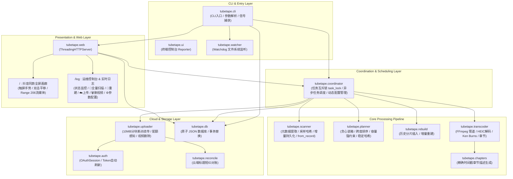
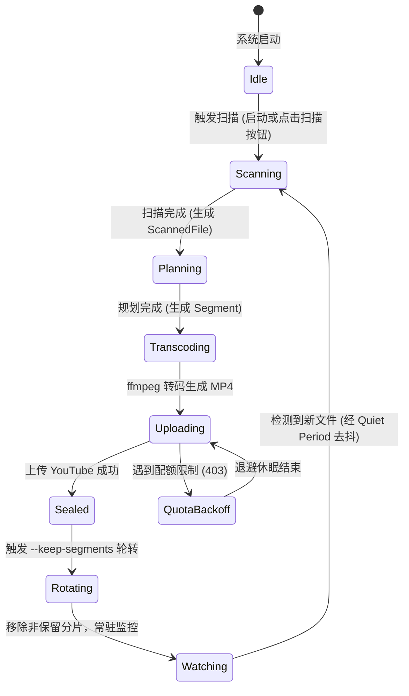

# TubeTape 核心架构与开发实现文档

> 本文档基于 TubeTape 真实代码库从零编写，系统性阐述系统架构设计、核心模块实现、关键算法与数据结构、数据持久化规范以及测试验证体系。

---

## 目录

- [1. 系统设计原则与哲学](#1-系统设计原则与哲学)
- [2. 系统全局架构与模块拓扑](#2-系统全局架构与模块拓扑)
- [3. 数据库模型与存储规范 (db.py)](#3-数据库模型与存储规范-dbpy)
- [4. 核心流水线实现与算法拆解](#4-核心流水线实现与算法拆解)
  - [4.1 媒体扫描与快速采样哈希 (scanner.py)](#41-媒体扫描与快速采样哈希-scannerpy)
  - [4.2 时间线贪心分片与容量强约束 (planner.py)](#42-时间线贪心分片与容量强约束-plannerpy)
  - [4.3 增量重建机制 (rebuild.py)](#43-增量重建机制-rebuildpy)
  - [4.4 高保真视频转码引擎 (transcoder.py)](#44-高保真视频转码引擎-transcoderpy)
  - [4.5 视频章节与时间戳生成 (chapters.py)](#45-视频章节与时间戳生成-chapterspy)
  - [4.6 云端对账与防截断短 ID 容灾 (reconcile.py)](#46-云端对账与防截断短-id-容灾-reconcilepy)
  - [4.7 YouTube 分块上传与配额自愈 (uploader.py)](#47-youtube-分块上传与配额自愈-uploaderpy)
  - [4.8 认证流与 Token 自愈 (auth.py)](#48-认证流与-token-自愈-authpy)
  - [4.9 核心协同调度器 (coordinator.py)](#49-核心协同调度器-coordinatorpy)
  - [4.10 动态文件系统监控 (watcher.py)](#410-动态文件系统监控-watcherpy)
  - [4.11 Web 交互系统与流媒体引擎 (web.py)](#411-web-交互系统与流媒体引擎-webpy)
  - [4.12 命令行入口与管线编排 (cli.py)](#412-命令行入口与管线编排-clipy)
- [5. 数据生命周期与状态流转](#5-数据生命周期与状态流转)
- [6. 测试体系与质量保障](#6-测试体系与质量保障)
- [7. 构建、打包与容器化规范](#7-构建打包与容器化规范)

---

## 1. 系统设计原则与哲学

TubeTape 的设计旨在解决家庭媒体海量数据长期保存与安全备份问题，遵循以下工程哲学：

1. **归档优先 (Archive-First)**：
   最终每一个文件恰好属于一个时间段分片，分片严格按照真实拍摄时间先后单调递增，内容自洽且完整。
2. **源文件不可变 (Source Immutability)**：
   输入的源文件目录以只读方式挂载或处理，系统代码中绝不包含任何对原始照片/视频的修改或删除逻辑。
3. **分片不可变与按需重建 (Immutable Segments & Rebuild)**：
   由于 YouTube 不支持替换已上传视频的底层文件，更新分片必须遵循“先上传新片，新片落盘入库成功后再删除/废弃旧片”原则，杜绝更新失败导致数据断档。
4. **确定性与无状态容灾 (Stateless Cloud Reconciliation)**：
   本地分片 ID 由素材集合与参数哈希决定；视频标题内嵌防截断短哈希。本地数据库丢失时，依靠云端元数据即可重建索引，零重复上传。
5. **增量自愈与零中断保护 (Resilience & Self-Healing)**：
   Token 失效自动后台刷新；网络断流 10MB 分块平滑续传；YouTube 配额耗尽自动退避；扫描过程中阶段性原子保存，避免长任务中断丢失状态。
6. **Docker 平稳停机防孤儿视频 (Clean Graceful Shutdown)**：
   捕获 `SIGTERM`/`SIGINT` 信号安全退出，停机阶段不强行开启新转码，避免 Docker 10 秒超时 `SIGKILL` 产生未录入数据库的孤儿视频。
7. **零外部框架依赖 (Zero Framework Overhead)**：
   Web 服务基于 Python 原生 `http.server.ThreadingHTTPServer`，不引入大型异步 Web 框架，确保在 NAS 等低配硬件上极低常驻内存占用与零网络端口死锁。

---

## 2. 系统全局架构与模块拓扑



### 核心模块职责映射表

| 模块路径 | 职责定位 | 关键类与核心函数 |
|---|---|---|
| `tubetape.db` | 原子单文件持久化数据库 | `Database`、`DatabaseError`、`SCHEMA_VERSION` |
| `tubetape.scanner` | 媒体扫描、格式探测、采样哈希与恢复 | `scan()`、`sample_hash()`、`ScannedFile`、`probe_video()`、`ScannedFile.from_record()` |
| `tubetape.planner` | 时间线分片规划、容量约束与稳定指纹 | `plan()`、`compute_segment_id()`、`Segment`、`Plan`、`greedy_pack()` |
| `tubetape.rebuild` | 增量分片插入与两阶段重建替换 | `rebuild_segment()`、`Rebuilder` |
| `tubetape.transcoder` | ffmpeg 管道装配、转码执行与进度回调 | `transcode_segment()`、`TranscodeConfig`、`compute_canvas()` |
| `tubetape.chapters` | 章节与精准跳转时间戳生成 | `chapters_text()` |
| `tubetape.auth` | Google OAuth 交互、Token 自动刷新 | `ensure_credentials()`、`OAuthSession`、`headless_oauth_flow()` |
| `tubetape.reconcile` | 云端频道对账与容灾自愈 | `fetch_remote_index()` |
| `tubetape.uploader` | YouTube 分块上传、配额感知与视频删除 | `YouTubeUploader`、`QuotaExceededError`、`delete_video()` |
| `tubetape.coordinator` | 全局异步任务调度、互斥锁与动态配置管理 | `AppCoordinator`、`rotate_uploaded_segments()`、`find_local_segment_file()` |
| `tubetape.watcher` | 文件系统动态监听与静默去抖 | `MediaWatcher`、`MtimeScanner` |
| `tubetape.web` | 画廊、仪表盘、REST API 与 Range 206 串流 | `WebServer`、`_RequestHandler`、`set_app_coordinator()` |
| `tubetape.cli` | 命令行参数解析、生命周期编排与停机 | `main()`、`run_pipeline()`、`build_parser()` |

---

## 3. 数据库模型与存储规范 (db.py)

TubeTape 采用纯标准库实现的单文件 JSON 数据库。为确保强一致性与断电零损坏，数据持久化采用了 **原子替换写入机制**。

### 3.1 原子写入保证
```python
# db.py 写入逻辑核心
fd, tmp_path = tempfile.mkstemp(dir=directory, prefix=".tubetape-", suffix=".tmp")
try:
    with os.fdopen(fd, "w", encoding="utf-8") as handle:
        handle.write(payload)
        handle.flush()
        os.fsync(handle.fileno())  # 确保物理落盘
    os.replace(tmp_path, target)   # POSIX 原生原子重命名
except BaseException:
    os.unlink(tmp_path)
    raise
```

### 3.2 Schema V1 规范定义
```json
{
  "version": 1,
  "files": {
    "<file_id>": {
      "path": "2024/05/IMG_1234.JPG",
      "name": "IMG_1234.JPG",
      "type": "image",
      "captured_at_utc": "2024-05-01T12:00:00Z",
      "resolution": "4032x3024",
      "duration_seconds": 3.0,
      "size_bytes": 4194304,
      "sha256": "4a7b...",
      "location": {"lat": 31.2304, "lng": 121.4737},
      "missing_meta": false
    }
  },
  "segments": {
    "<segment_id>": {
      "file_ids": ["<file_id_1>", "<file_id_2>"],
      "range": ["2024-05-01T12:00:00Z", "2024-05-01T12:20:00Z"],
      "duration_seconds": 1200.0,
      "output_path": "/db/uploaded_segments/20240501-120000 - 20240501-122000 [a1b2c3d4e5f6].mp4",
      "youtube_video_id": "dQw4w9WgXcQ",
      "previous_video_ids": [],
      "status": "sealed",
      "chapters": [["0:00", "20240501-120000"], ["0:03", "20240501-120003"]],
      "last_rebuilt_at": null,
      "attempts": 1,
      "error": null
    }
  }
}
```

---

## 4. 核心流水线实现与算法拆解

### 4.1 媒体扫描与快速采样哈希 (scanner.py)

#### 支持的格式矩阵
- **图片**：`.jpg`、`.jpeg`、`.png`、`.heic`、`.heif`、`.tif`、`.tiff`、`.webp`、`.bmp`。
- **视频**：`.mp4`、`.mov`、`.m4v`、`.avi`、`.mkv`、`.webm`、`.3gp`。

#### 快速采样哈希算法 (Fast Sample Hash)
对于数十 GB 的超大视频，全量读取计算 SHA-256 会导致巨额磁盘 I/O。TubeTape 实现了头中尾采样哈希算法：
1. 若文件大小 $\le 192\text{ KB}$，整读计算 SHA-256。
2. 若文件大小 $> 192\text{ KB}$，分别抽取：
   - 头部 $64\text{ KB}$
   - 中部 $64\text{ KB}$（offset = `(size - 64KB) // 2`）
   - 尾部 $64\text{ KB}$（offset = `size - 64KB`）
3. 将三段切片与 8 字节大端整数文件尺寸拼接后计算 SHA-256。
**效果**：首次全量冷扫描吞吐量提升约 10 倍；读取量从数百 GB 骤降至数 GB。

#### 增量哈希缓存 (mtime + size Cache)
扫描器内部维护 `(rel_path, size_bytes, mtime_ns)` 索引：
- 只要文件尺寸与纳秒级修改时间未变，直接复用已持久化的元数据与哈希值。
- 热扫描 2,500+ 个文件的耗时仅需约 0.2 秒。
- 扫描期间每 1,000 个文件或每 30 秒阶段性保存一次数据库，杜绝中途强退导致已扫描数据丢失。

#### 从数据库恢复扫描对象 (`ScannedFile.from_record`)
为支持 `--no-scan` 极速冷启动，`ScannedFile` 提供了 `from_record(file_id, record, input_dir)` 工厂方法：
- 直接从 `db.json` 中的 `files` 字段反序列化出完整的 `ScannedFile` 领域模型，包含绝对路径重组、拍摄时间恢复、分类标记恢复与时长恢复。
- 使系统在启动时完全跳过磁盘 `os.walk`，实现毫秒级启动并直接进入规划与监控状态。

---

### 4.2 时间线贪心分片与容量强约束 (planner.py)

#### 确定性排序规则
所有文件按 `(captured_epoch, file_id)` 元组严格升序排序。无拍摄时间的素材统一置于时间线末尾，`file_id` 作为次级排序键保证严格确定性。

#### 稳定分片 ID (Segment ID) 计算
分片 ID 不依赖执行时间或随机数，仅由分片内文件哈希与转码配置参数严格决定：
$$\text{segment\_id} = \text{SHA256}\left(\sum_{f \in \text{sorted(file\_ids)}} f + \sum_{p \in \text{params}} p\right)$$
任何素材的增加、删除或转码参数变动，必然导致计算出全新的 `segment_id`，从而自动触发增量转码与云端更新。

#### 8 小时长视频根本原因与容量强约束防护
在早期版本中，当大量素材跨越不同历史区间重建时，候选区间的选择逻辑若缺乏跨度约束，可能导致贪心装箱误将后续数千张跨越数年的素材全部塞入同一个分片，产生如 8 小时 32 分钟的异常长视频。
为此，管线在 `planner.py` 中实现了三重保护体系：
1. **剩余容量严格钳位 (`remaining_capacity`)**：
   在分片扩充与合并过程中，严格实时计算 `remaining_capacity = max(0.0, target_duration - current_duration)`。任何素材一旦超出该分片的目标容量，立即强制截断，绝不允许无休止累加。
2. **窄跨度区间优先匹配**：
   多候选区间匹配时，按 `cand.range_end - cand.range_start` 严格升序排序，优先收敛到最局部的紧凑分片，防止跨度数年的泛化分片贪婪吞噬后续素材。
3. **溢出切分 (`greedy_pack`)**：
   若某历史分片合并后总时长超出 `segment_duration`，自动将其交由 `greedy_pack` 重新分割成若干合规的标准时长分片，彻底杜绝单视频时长超标。

---

### 4.3 增量重建机制 (rebuild.py)

当用户向过去日期的文件夹中追加历史老照片时，TubeTape 不会打乱后续所有分片，而是执行局部重构：
1. 识别包含该时间戳的历史分片 $S_{\text{old}}$。
2. 将老分片内原有素材与新插入素材合并，规划为重建分片 $S_{\text{new}}$，并标记 `replaces_segment_id = S_old.segment_id`。
3. 转码引擎为 $S_{\text{new}}$ 生成视频并上传至 YouTube。
4. **两阶段提交**：只有当 $S_{\text{new}}$ 成功在 YouTube 产生新的 `video_id` 且在本地数据库持久化后，系统才调用 YouTube API 删除废弃的 $S_{\text{old}}$ 视频。若云端删除失败，仅记入日志，不阻塞流水线。

---

### 4.4 高保真视频转码引擎 (transcoder.py)

#### 自适应包围盒画布 (Bounding Box Canvas)
- 当 `--canvas-mode max` 时，动态扫描分片内所有静态照片与视频的分辨率：
  $$W_{\text{canvas}} = \min(\max_{i} W_i, W_{\text{max\_res}}), \quad H_{\text{canvas}} = \min(\max_{i} H_i, H_{\text{max\_res}})$$
- 确保输出符合 16:9 / 4:3 像素对齐（偶数化），对横屏与竖屏混排场景自动加黑边居中填充，素材本身绝不降采样。

#### iPhone HEIC 转码桥接
由于大多数标准 Linux ffmpeg 发行版并未编译 `libheif`，转码器在处理 HEIC/HEIF 图片时：
- 先通过 Python `Pillow` + `pillow-heif` 将其解码为临时无损 PNG 图像。
- 将临时 PNG 送入 ffmpeg 的 concat demuxer 管道，彻底避开底层编解码器缺失问题。

#### Ken Burns 运镜滤镜生成
若开启 `--ken-burns`，为静态照片生成平滑的缩放平移变换滤镜：
```
zoompan=z='min(zoom+0.0015,1.25)':d=180:x='iw/2-(iw/zoom/2)':y='ih/2-(ih/zoom/2)':s=3840x2160:fps=60
```

---

### 4.5 视频章节与时间戳生成 (chapters.py)

TubeTape 在视频简介中输出符合 YouTube 播放器点击跳转识别规范的纯时间戳文本：
```
0:00 20240501-120000
0:03 20240501-120003
0:15 20240501-120015
```
不使用冗余的格式字符，每一个对应照片/视频均可在播放器时间轴上形成可交互章节。

---

### 4.6 云端对账与防截断短 ID 容灾 (reconcile.py)

#### 标题内嵌防截断短 ID
视频标题命名规则严格定义为：
```
{start_ts} - {end_ts} [{short_id}]
```
其中 `short_id = segment_id[:16]`。
- **背景**：YouTube Data API 会自动清洗并截断过长的视频简介，导致存放在简介末尾的 Marker 丢失。
- **机制**：标题尾部的短 ID 永不被截断。`fetch_remote_index` 通过 `channels.list` 与 `playlistItems.list` 仅拉取标题文本，即可在本地库缺失时自动恢复映射并跳过已传分片。

---

### 4.7 YouTube 分块上传与配额自愈 (uploader.py)

#### 10MB 分块断点续传 (Resumable Chunking)
使用 Google API 的 `MediaFileUpload(..., resumable=True, chunksize=10*1024*1024)`：
```python
response = None
while response is None:
    status, response = request.next_chunk()
    if status:
        _logger.debug("uploaded %d/%d bytes (%.1f%%)", status.resumable_progress, status.total_size, status.progress() * 100)
```
遭遇网络瞬断时触发指数退避，在当前断点直接重试下一个 10MB 分块，避免重新发起长视频建片。

#### 配额耗尽感知 (Quota Exhaustion Handling)
捕获 `googleapiclient.errors.HttpError`：
- 若错误码为 403 且包含 `quotaExceeded`，抛出内部 `QuotaExceededError`。
- 上层流水线自动保存数据库，设置休眠退避（默认 1 小时），返回退出码 `_EXIT_QUOTA = 2`。

#### 云端视频删除 (`delete_video`)
调用 YouTube API `youtube.videos().delete(id=video_id).execute()` 实现云端物理删除，支持静默重试与 404 已删除幂等容错。

---

### 4.8 认证流与 Token 自愈 (auth.py)

1. **统一门面 `ensure_credentials`**：
   - 检查 `token.json` 存在性。
   - 校验是否过期：若凭据过期且具备 `refresh_token`，自动调用 `creds.refresh(Request())` 刷新，并将新凭据以 `0600` 文件权限持久化写回磁盘。
2. **双模授权引擎 `OAuthSession`**：
   - 维护内置 state 与 flow。
   - 既支持纯终端命令行 `--login` 交互式输入，也支持 Web 容器环境无头等待授权。

---

### 4.9 核心协同调度器 (coordinator.py)

`AppCoordinator` 是整个运行时的指挥枢纽，负责后台异步任务编排、互斥执行锁、动态配置热更新及本地视频轮转：

#### 1. 全局任务互斥锁 (`task_lock`)
为防止用户在 Web 界面同时点击“全量扫描”与“重新构建”导致 ffmpeg 资源争抢与数据库并发脏写，`coordinator` 实现了 `task_lock = threading.Lock()`。
所有异步操作统一通过互斥锁申请；若有任务正在执行，后续操作直接返回 400 提示友好错误。

#### 2. 核心异步动作调度
- **`trigger_scan()`**：启动后台守护线程，执行磁盘扫描 -> 规划 -> 转码 -> 轮转全流程。
- **`rebuild_segment(segment_id)`**：针对指定分片提取素材，原地调用 ffmpeg 重新压制，并在非 `--no-upload` 模式下直接上传。
- **`upload_segment(segment_id)`**：检查 `uploaded_segments/` 目录下是否存在该分片已有的 MP4，若存在则跳过转码直接执行断点续传。
- **`delete_youtube_video(segment_id)`**：调用 YouTube API 删除云端视频，并同步重置本地数据库状态为待处理。

#### 3. 动态配置管理与持久化 (`config.json`)
- 支持在运行时动态热更新参数。
- 维护 `FINGERPRINT_PARAMS` 集合：
  ```python
  FINGERPRINT_PARAMS = frozenset([
      "segment_duration", "image_duration", "crf",
      "max_resolution", "canvas_mode", "fps",
      "x264_preset", "ken_burns",
  ])
  ```
- 修改配置时自动比对受影响字段，若涉及指纹字段则向 Web 界面返回风险提示。配置变更立即原子落盘至 `<db_dir>/config.json`，下一次程序启动时自动优先载入。

#### 4. 本地分片轮转管理 (`rotate_uploaded_segments`)
- 扫描 `<db_dir>/uploaded_segments/` 目录中的所有非隐藏 `.mp4` 文件。
- 按文件修改时间 `st_mtime` 倒序排列，保留最新的 $N$ 个文件，超出的旧文件自动执行安全清理。

---

### 4.10 动态文件系统监控 (watcher.py)

基于 `watchdog.observers.Observer` 监听目录变动：
- **Quiet Period 去抖动**：检测到变动后，必须维持 10 分钟无新写入才触发构建，防止素材尚在网络写入途中被截断。
- **mtime 兜底巡检**：每小时触发一次目录修改时间巡检，作为 inotify/FSEvents 在特定网络文件系统（NFS/CIFS）下的安全保障。

---

### 4.11 Web 交互系统与流媒体引擎 (web.py)

`web.py` 在独立守护线程中运行 `ThreadingHTTPServer`，提供完整的单页应用与流媒体支持。

#### 1. 路由与 API 拓扑
- `GET /`：全屏时间线画廊 HTML。
- `GET /log` 与 `GET /logs`：仪表盘与实时日志控制台 HTML。
- `GET /api/status`：核心运行状态与当前任务 JSON。
- `GET /api/dashboard`：包含扫描统计、分段列表、构建进度、本地保留视频统计及分段可用动作的综合大屏接口。
- `GET /api/config`：获取当前运行配置及指纹参数清单。
- `POST /api/config`：动态更新运行参数并保存至 `config.json`。
- `POST /api/scan/start`：异步触发全量扫描任务。
- `POST /api/segment/rebuild`：异步触发指定分片重新构建。
- `POST /api/segment/upload`：异步触发指定分片本地视频直传。
- `POST /api/segment/delete_youtube`：调用 API 删除云端对应视频。
- `GET /api/media/summary`：时间线年月分布统计（支持侧边栏 Scrubber）。
- `GET /api/media/items`：按时间线分页拉取媒体元数据。
- `GET /api/media/view?id=...`：高清图片展示接口（支持 HEIC 转码缓存与路径穿越防护）。
- `GET /api/media/stream?id=...`：视频流点播接口（实现 HTTP 206 Range 协议）。
- `POST /api/auth/submit`：OAuth 授权凭据提交接口。
- `GET /api/logs`：增量日志流拉取接口。

#### 2. HTTP 206 Partial Content (Range) 实现
```python
# Range 头部解析与分块供给
match = re.match(r"bytes=(\d+)-(\d*)", range_header)
if match:
    start = int(match.group(1))
    end = int(match.group(2)) if match.group(2) else min(start + 2*1024*1024 - 1, file_size - 1)
    length = end - start + 1
    self.send_response(206)
    self.send_header("Content-Range", f"bytes {start}-{end}/{file_size}")
    self.send_header("Content-Length", str(length))
    self.send_header("Accept-Ranges", "bytes")
    self.end_headers()
    # 64KB 步长向客户端管道写出
```

#### 3. 路径穿越安全防护 (Path Traversal Protection)
所有媒体请求均强制进行目录前缀校验：
```python
abs_path = os.path.abspath(os.path.join(media_dir, rel_path))
if not abs_path.startswith(os.path.abspath(media_dir)):
    return None, None  # 拒绝访问 media_dir 外部文件
```

---

### 4.12 命令行入口与管线编排 (cli.py)

- **配置加载层叠优先级**：
  CLI 命令行参数 > `config.json` 运行时持久化配置 > 代码内置默认参数。
- **无凭证纯本地模式兼容**：
  若设置 `--no-upload`，管线完全跳过 Google OAuth 凭据加载与云端对账，直接执行本地转码并退出或进入文件监控。
- **平稳停机机制**：
  捕获 `SIGTERM` 与 `SIGINT`，设置内部退出事件，当前正在转码或上传的块平稳结束后安全退出，保证数据库完整。

---

## 5. 数据生命周期与状态流转



---

## 6. 测试体系与质量保障

TubeTape 配备了完整的自动化测试套件（基于 `pytest`），对外部依赖进行了严格隔离：
- **测试用例总数**：256 项自动化测试全部通过。
- **覆盖范围**：
  - `test_cli.py`：参数解析后置校验、流程编排、退出码、本地分片轮转逻辑、`--no-scan` 与 `--no-upload` 模式。
  - `test_scanner.py`：格式探测、EXIF/ffprobe 解析、文件名正则兜底、快速采样哈希正确性、哈希缓存、`from_record` 恢复。
  - `test_planner.py`：贪心装箱、稳定分片 ID、同秒边界处理、Pending 队列、长视频容量钳位与切分。
  - `test_rebuild.py`：增量分片插入与两阶段提交。
  - `test_transcoder.py`：画布几何计算、Ken Burns 滤镜、ffmpeg 指令拼装、磁盘空间检测。
  - `test_uploader.py`：分块流式上传、配额错误捕获、播放列表写入。
  - `test_auth.py`：无头授权、Token 自动刷新、过期自愈。
  - `test_reconcile.py`：云端标题短 ID 匹配与索引恢复。
  - `test_watcher.py`：Watchdog 事件派发与去抖。
  - `test_web.py`：画廊展示、Dashboard 统计、HEIC 动态转码、视频 Range 206 流式传输、OAuth 回调拦截、参数配置 API、分段操作调度 API。

执行全量测试套件：
```bash
pytest -v
```

---

## 7. 构建、打包与容器化规范

### Docker 容器化设计
- **基础镜像**：`python:3.11-slim`。
- **系统包**：`ffmpeg`（视频解码/编码）、`tzdata`（时区库）、`ca-certificates`（HTTPS 证书）。
- **Python 依赖隔离**：通过 `pyproject.toml` 标准机制安装，不夹带测试套件。
- **运行入口**：`ENTRYPOINT ["tubetape"]`，支持 CLI 参数透明透传。

构建与本地运行镜像：
```bash
docker build -t tubetape:latest .
```
